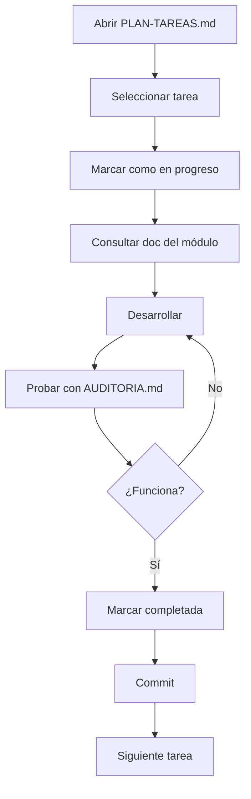

# 🚀 Inicio Rápido - LexHoy

**Para:** Desarrollo diario  
**Tiempo de lectura:** 3 minutos

---

## 📅 Rutina Diaria

### Al Empezar el Día

**1. Abre este archivo primero:**
```
docs/06-TAREAS/PLAN-TAREAS.md
```

**2. Revisa:**
- ✅ Tareas completadas ayer
- 🔄 Tareas en progreso
- 📋 Próxima tarea a realizar

**3. Marca la tarea en la que vas a trabajar:**
```markdown
- [/] Tarea en progreso  ← Cambia [ ] a [/]
```

---

## 📂 Estructura de Documentación

### Documentos Clave (en orden de importancia)

#### 1️⃣ **PLAN-TAREAS.md** ⭐ ABRIR CADA DÍA
```
docs/06-TAREAS/PLAN-TAREAS.md
```
**Qué contiene:** Todas las tareas pendientes organizadas por fases  
**Cuándo usar:** Todos los días al empezar y al terminar

#### 2️⃣ **AUDITORIA.md** ⭐ USAR AL PROBAR
```
docs/06-TAREAS/AUDITORIA.md
```
**Qué contiene:** Checklist de 150+ verificaciones  
**Cuándo usar:** Al probar funcionalidades

#### 3️⃣ **Documentos de Módulos** (según lo que estés desarrollando)
```
docs/03-MODULOS/USUARIOS.md      ← Si trabajas con usuarios
docs/03-MODULOS/DESPACHOS.md     ← Si trabajas con despachos
docs/03-MODULOS/LEADS.md         ← Si trabajas con leads
docs/03-MODULOS/MARKETING.md     ← Si trabajas con marketing
docs/03-MODULOS/ADMIN.md         ← Si trabajas en admin panel
```

#### 4️⃣ **README Principal**
```
docs/README.md
```
**Qué contiene:** Índice de toda la documentación  
**Cuándo usar:** Cuando no sabes dónde buscar algo

---

## 🔄 Flujo de Trabajo

### Trabajando en una Tarea



### Ejemplo Práctico

**Tarea:** Implementar sistema de compra de leads

**Paso 1:** Abrir plan de tareas
```bash
code docs/06-TAREAS/PLAN-TAREAS.md
```

**Paso 2:** Buscar la tarea
```markdown
### 1.3 Sistema de Compra de Leads (MVP)
- [ ] 1.3.1 Integrar Stripe
- [ ] 1.3.2 Lógica de compra directa
```

**Paso 3:** Marcar como en progreso
```markdown
- [/] 1.3.1 Integrar Stripe  ← Cambio aquí
```

**Paso 4:** Consultar documentación del módulo
```bash
code docs/03-MODULOS/LEADS.md
# Buscar sección "Sistema de Compra"
```

**Paso 5:** Desarrollar la funcionalidad

**Paso 6:** Probar con auditoría
```bash
code docs/06-TAREAS/AUDITORIA.md
# Buscar sección "Módulo de Leads"
# Marcar checks según pruebas
```

**Paso 7:** Marcar como completada
```markdown
- [x] 1.3.1 Integrar Stripe  ← Completada!
```

**Paso 8:** Commit
```bash
git add .
git commit -m "feat: integrar Stripe para compra de leads [1.3.1]"
git push
```

---

## 📍 Navegación Rápida

### ¿Qué necesitas?

| Necesito... | Abrir... |
|-------------|----------|
| Ver qué hacer hoy | `06-TAREAS/PLAN-TAREAS.md` |
| Entender cómo funciona X | `03-MODULOS/[MODULO].md` |
| Probar funcionalidad | `06-TAREAS/AUDITORIA.md` |
| Ver esquema de BD | `02-BASE-DATOS/ESQUEMA.md` |
| Ver endpoints API | `04-API/ENDPOINTS.md` |
| Buscar algo | `README.md` → Índice |

### Atajos de VS Code

```bash
# Buscar en toda la documentación
Ctrl+Shift+F → buscar en docs/

# Abrir archivo rápido
Ctrl+P → escribir nombre del archivo

# Buscar símbolo
Ctrl+T → buscar función/clase
```

---

## 🗂️ Estructura Limpia

```
docs/
├── README.md                    ← Índice general
│
├── 00-INICIO/                   ← (Vacío por ahora)
├── 01-ARQUITECTURA/             ← (Vacío por ahora)
│
├── 02-BASE-DATOS/               ← Base de datos
│   └── ESQUEMA.md              ← Esquema completo
│
├── 03-MODULOS/                  ← ⭐ DOCUMENTACIÓN PRINCIPAL
│   ├── USUARIOS.md             ← Todo sobre usuarios
│   ├── DESPACHOS.md            ← Todo sobre despachos
│   ├── LEADS.md                ← Todo sobre leads
│   ├── MARKETING.md            ← Todo sobre marketing
│   └── ADMIN.md                ← Panel de administración
│
├── 04-API/                      ← API
│   └── ENDPOINTS.md            ← Lista de endpoints
│
├── 05-DESARROLLO/               ← (Vacío por ahora)
│
├── 06-TAREAS/                   ← ⭐ GESTIÓN DIARIA
│   ├── PLAN-TAREAS.md          ← 📅 ABRIR CADA DÍA
│   └── AUDITORIA.md            ← ✅ Checklist de pruebas
│
└── 99-ARCHIVO/                  ← Documentos obsoletos
    └── (archivos antiguos)
```

---

## ✅ Checklist Diaria

### Al Empezar

- [ ] Abrir `PLAN-TAREAS.md`
- [ ] Revisar tareas pendientes
- [ ] Seleccionar tarea del día
- [ ] Marcar como `[/]` en progreso
- [ ] Consultar doc del módulo relevante

### Durante el Desarrollo

- [ ] Seguir la documentación del módulo
- [ ] Hacer commits frecuentes
- [ ] Actualizar notas si encuentras algo

### Al Terminar

- [ ] Probar con `AUDITORIA.md`
- [ ] Marcar tarea como `[x]` completada
- [ ] Commit final
- [ ] Actualizar `PLAN-TAREAS.md`

---

## 🎯 Reglas de Oro

1. **SIEMPRE** empieza el día abriendo `PLAN-TAREAS.md`
2. **NUNCA** trabajes sin marcar la tarea como `[/]`
3. **SIEMPRE** consulta el doc del módulo antes de desarrollar
4. **SIEMPRE** prueba con `AUDITORIA.md` antes de marcar completada
5. **SIEMPRE** haz commit con referencia a la tarea: `[1.3.1]`

---

## 🆘 ¿Perdido?

### Si no sabes qué hacer:
→ Abre `docs/06-TAREAS/PLAN-TAREAS.md`

### Si no sabes cómo funciona algo:
→ Abre `docs/03-MODULOS/[MODULO].md`

### Si no encuentras algo:
→ Abre `docs/README.md` y busca en el índice

### Si quieres probar:
→ Abre `docs/06-TAREAS/AUDITORIA.md`

---

## 📱 Acceso Rápido

### Favoritos de VS Code

Añade a tus favoritos:
1. `docs/06-TAREAS/PLAN-TAREAS.md` ⭐
2. `docs/06-TAREAS/AUDITORIA.md` ⭐
3. `docs/03-MODULOS/` (carpeta completa)
4. `docs/README.md`

### Snippets Útiles

```json
// .vscode/settings.json
{
  "files.associations": {
    "**/docs/**/*.md": "markdown"
  },
  "markdown.preview.breaks": true
}
```

---

**Última actualización:** 2025-12-02  
**Mantenido por:** José Ramón Blanco Casal

---

## 🎉 ¡Listo para Empezar!

**Ahora mismo, abre:**
```
docs/06-TAREAS/PLAN-TAREAS.md
```

**Y selecciona tu primera tarea del día.**

¡Éxito! 🚀
