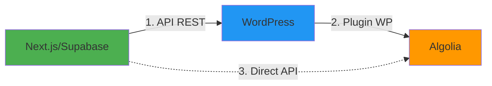
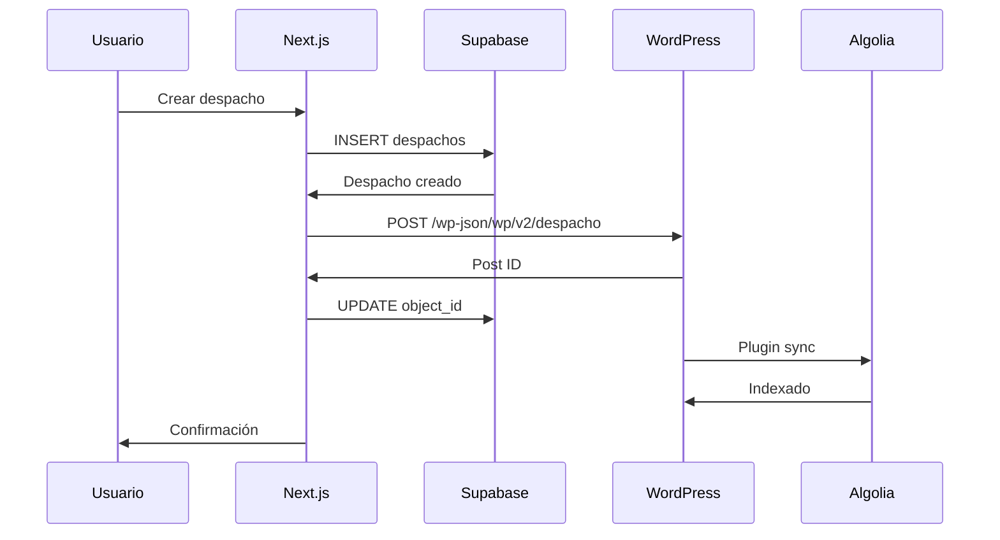
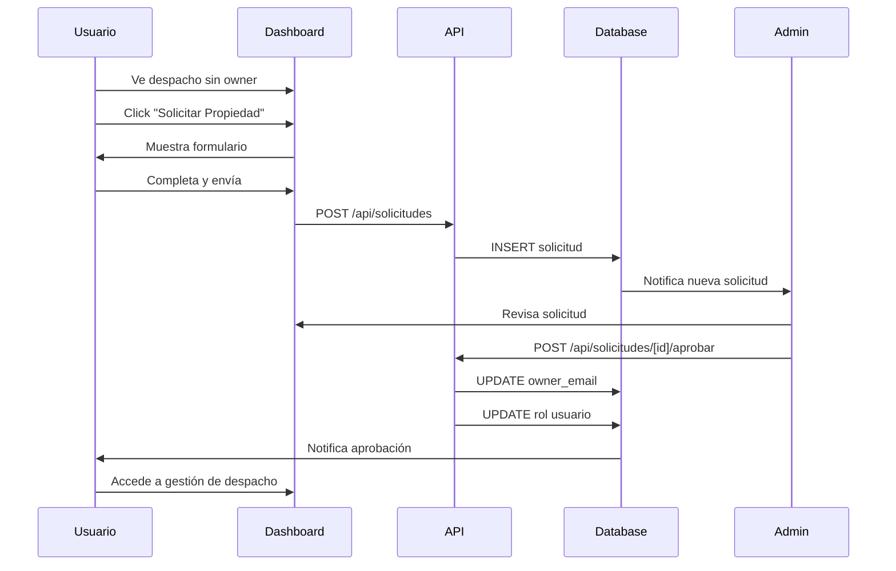
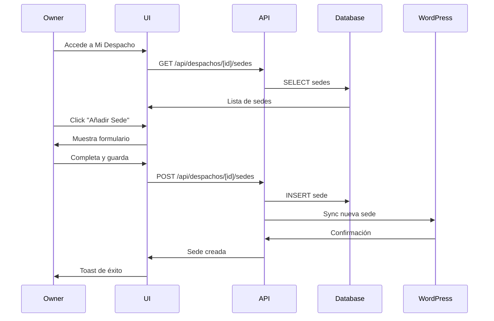

# Módulo de Despachos

**Versión:** 1.0  
**Última actualización:** 2025-12-02  
**Estado:** ✅ Implementado (95%)

---

## 📋 Índice

1. [Visión General](#visión-general)
2. [Conceptos Clave](#conceptos-clave)
3. [Sistema de Ownership](#sistema-de-ownership)
4. [Gestión de Sedes](#gestión-de-sedes)
5. [Sincronización Multi-Sistema](#sincronización-multi-sistema)
6. [Flujos Principales](#flujos-principales)
7. [Base de Datos](#base-de-datos)
8. [API Endpoints](#api-endpoints)
9. [Componentes](#componentes)
10. [Estado Actual](#estado-actual)

---

## 🎯 Visión General

El módulo de despachos es el **core del sistema**. Gestiona:
- Información de despachos de abogados
- Sistema de ownership único
- Múltiples sedes por despacho
- Sincronización con WordPress y Algolia
- Solicitudes de propiedad
- Estados de publicación y verificación

### Tecnologías Utilizadas

- **Base de Datos:** Supabase PostgreSQL
- **CMS:** WordPress (custom post type `despacho`)
- **Búsqueda:** Algolia
- **Frontend:** Next.js 14 + React
- **Sincronización:** REST APIs

---

## 🔑 Conceptos Clave

### Despacho

Un **despacho** es una firma de abogados que puede tener:
- 1 o más sedes (oficinas)
- 1 único propietario (owner)
- Múltiples áreas de práctica
- Estados de publicación y verificación

### Sede

Una **sede** es una oficina física del despacho:
- Cada despacho tiene AL MENOS 1 sede (principal)
- Puede tener múltiples sedes adicionales
- Solo 1 sede puede ser "principal"
- Contiene dirección, contacto, horarios, etc.

### Ownership

El **ownership** es la propiedad de un despacho:
- **Regla de oro:** 1 Despacho = 1 Owner
- Se identifica por `owner_email` en tabla `despachos`
- El owner tiene control total del despacho
- El owner automáticamente es `despacho_admin`

### Colaboradores

Los **colaboradores** son usuarios adicionales con acceso:
- Se gestionan en tabla `user_despachos`
- NO son owners, son asignaciones manuales
- Sistema secundario, no principal
- Tienen permisos limitados

---

## 👑 Sistema de Ownership

### Regla Principal

```
1 Despacho = 1 Owner (único y exclusivo)
```

### Implementación

```typescript
// Tabla despachos
{
  id: "uuid",
  object_id: 74971,
  nombre: "Vento Abogados & Asesores",
  owner_email: "blancocasal@gmail.com",  // ← ÚNICO OWNER
  // ... otros campos
}
```

### Verificación de Ownership

```typescript
async function isOwner(userId: string, despachoId: string): boolean {
  const { data: user } = await supabase
    .from('users')
    .select('email')
    .eq('id', userId)
    .single();
  
  const { data: despacho } = await supabase
    .from('despachos')
    .select('owner_email')
    .eq('id', despachoId)
    .single();
  
  return user?.email === despacho?.owner_email;
}
```

### Cambio de Owner

**Proceso:**

1. Admin aprueba solicitud de propiedad
2. Sistema asigna `owner_email` en `despachos`
3. Sistema promociona usuario a `despacho_admin`
4. Owner anterior (si existe) pierde acceso
5. Notificaciones enviadas

**Código:**
```typescript
async function changeOwner(
  despachoId: string, 
  newOwnerEmail: string
) {
  // 1. Actualizar despacho
  await supabase
    .from('despachos')
    .update({ owner_email: newOwnerEmail })
    .eq('id', despachoId);
  
  // 2. Promocionar nuevo owner
  await supabase
    .from('users')
    .update({ rol: 'despacho_admin' })
    .eq('email', newOwnerEmail);
  
  // 3. Verificar owner anterior
  // Si no tiene más despachos, degradar a usuario
  await checkAndDemoteUser(previousOwnerEmail);
}
```

---

## 🏢 Gestión de Sedes

### Estructura de Sedes

```
Despacho
├── Sede Principal (obligatoria)
│   ├── Nombre: "Sede Central Madrid"
│   ├── es_principal: true
│   ├── Dirección completa
│   ├── Contacto
│   └── Horarios
├── Sede Adicional 1 (opcional)
│   ├── Nombre: "Oficina Barcelona"
│   ├── es_principal: false
│   └── ...
└── Sede Adicional N (opcional)
```

### Reglas de Sedes

1. **Sede Principal Obligatoria**
   - Todo despacho DEBE tener 1 sede principal
   - No se puede eliminar si es la única sede
   - Solo 1 sede puede ser principal

2. **Cambio de Sede Principal**
   - Al marcar una sede como principal
   - La anterior automáticamente deja de serlo
   - Trigger en base de datos lo garantiza

3. **Eliminación de Sedes**
   - Se puede eliminar cualquier sede NO principal
   - NO se puede eliminar si es la única sede
   - Validación en frontend y backend

### Información de una Sede

```typescript
interface Sede {
  // Identificación
  id: string;
  despacho_id: string;
  nombre: string;
  descripcion?: string;
  
  // Contacto
  email_contacto: string;
  telefono: string;
  persona_contacto?: string;
  web?: string;
  
  // Dirección
  calle: string;
  numero: string;
  piso?: string;
  localidad: string;
  provincia: string;
  codigo_postal: string;
  pais: string;
  
  // Información profesional
  areas_practica: string[];
  especialidades?: string;
  servicios_especificos?: string;
  numero_colegiado?: string;
  colegio?: string;
  experiencia?: string;
  ano_fundacion?: string;
  tamano_despacho?: string;
  
  // Estados
  es_principal: boolean;
  activa: boolean;
  estado_verificacion: 'pendiente' | 'verificado' | 'rechazado';
  estado_registro: 'activo' | 'inactivo' | 'suspendido';
  is_verified: boolean;
  
  // Horarios (JSONB)
  horarios: {
    lunes?: string;
    martes?: string;
    miercoles?: string;
    jueves?: string;
    viernes?: string;
    sabado?: string;
    domingo?: string;
  };
  
  // Redes sociales (JSONB)
  redes_sociales: {
    facebook?: string;
    twitter?: string;
    linkedin?: string;
    instagram?: string;
  };
  
  // Multimedia
  foto_perfil?: string;
  
  // Notas
  observaciones?: string;
}
```

---

## 🔄 Sincronización Multi-Sistema

### Arquitectura de Sincronización



### Sistemas Involucrados

1. **Supabase (Fuente de Verdad)**
   - Base de datos principal
   - Todas las operaciones CRUD
   - Políticas RLS

2. **WordPress (CMS Público)**
   - Custom Post Type `despacho`
   - Página pública de cada despacho
   - SEO y contenido

3. **Algolia (Búsqueda)**
   - Índice de búsqueda
   - Filtros y facetas
   - Autocompletado

### Flujo de Sincronización

#### Crear Despacho



**Código:**
```typescript
async function createDespacho(data: DespachoData) {
  // 1. Crear en Supabase
  const { data: despacho } = await supabase
    .from('despachos')
    .insert({
      nombre: data.nombre,
      descripcion: data.descripcion,
      areas_practica: data.areas_practica,
      owner_email: data.owner_email,
      slug: slugify(data.nombre)
    })
    .select()
    .single();
  
  // 2. Crear sede principal
  await supabase
    .from('sedes')
    .insert({
      despacho_id: despacho.id,
      ...data.sedePrincipal,
      es_principal: true
    });
  
  // 3. Sincronizar con WordPress
  const wpResponse = await fetch(
    `${WP_URL}/wp-json/wp/v2/despacho`,
    {
      method: 'POST',
      headers: {
        'Authorization': `Bearer ${WP_TOKEN}`,
        'Content-Type': 'application/json'
      },
      body: JSON.stringify({
        title: despacho.nombre,
        content: despacho.descripcion,
        status: 'publish',
        meta: {
          sedes: [data.sedePrincipal],
          areas_practica: data.areas_practica
        }
      })
    }
  );
  
  const wpPost = await wpResponse.json();
  
  // 4. Guardar object_id de WordPress
  await supabase
    .from('despachos')
    .update({ object_id: wpPost.id })
    .eq('id', despacho.id);
  
  // 5. Algolia se sincroniza automáticamente via plugin WP
  
  return despacho;
}
```

#### Actualizar Despacho

```typescript
async function updateDespacho(
  despachoId: string, 
  updates: Partial<Despacho>
) {
  // 1. Actualizar en Supabase
  const { data: despacho } = await supabase
    .from('despachos')
    .update(updates)
    .eq('id', despachoId)
    .select()
    .single();
  
  // 2. Sincronizar con WordPress
  if (despacho.object_id) {
    await fetch(
      `${WP_URL}/wp-json/wp/v2/despacho/${despacho.object_id}`,
      {
        method: 'PUT',
        headers: {
          'Authorization': `Bearer ${WP_TOKEN}`,
          'Content-Type': 'application/json'
        },
        body: JSON.stringify({
          title: despacho.nombre,
          content: despacho.descripcion,
          meta: {
            areas_practica: despacho.areas_practica
          }
        })
      }
    );
  }
  
  return despacho;
}
```

### Manejo de Errores de Sincronización

```typescript
async function syncWithRetry(
  operation: () => Promise<any>,
  maxRetries = 3
) {
  for (let i = 0; i < maxRetries; i++) {
    try {
      return await operation();
    } catch (error) {
      // Log error
      await supabase
        .from('sync_logs')
        .insert({
          tipo: 'wordpress',
          error: error.message,
          reintentos: i + 1
        });
      
      if (i === maxRetries - 1) {
        // Notificar a admin
        await notifyAdmin('Sync failed after retries');
        throw error;
      }
      
      // Wait before retry
      await new Promise(r => setTimeout(r, 1000 * (i + 1)));
    }
  }
}
```

---

## 🔄 Flujos Principales

### Flujo 1: Solicitud de Propiedad



**Formulario de Solicitud:**
```typescript
interface SolicitudPropiedad {
  despacho_id: string;
  tipo_solicitud: 'propiedad' | 'colaboracion';
  justificacion: string;
  documentos_adjuntos?: string[];
}
```

**Estados de Solicitud:**
- `pendiente` - Esperando revisión
- `aprobada` - Aprobada por admin
- `rechazada` - Rechazada por admin

### Flujo 2: Gestión de Sedes



**Validaciones al Añadir Sede:**
```typescript
async function validateNewSede(sede: SedeData) {
  // 1. Campos obligatorios
  if (!sede.nombre || !sede.localidad || !sede.provincia) {
    throw new Error('Campos obligatorios faltantes');
  }
  
  // 2. Email válido
  if (sede.email_contacto && !isValidEmail(sede.email_contacto)) {
    throw new Error('Email inválido');
  }
  
  // 3. Si es principal, desmarcar otras
  if (sede.es_principal) {
    await supabase
      .from('sedes')
      .update({ es_principal: false })
      .eq('despacho_id', sede.despacho_id);
  }
  
  return true;
}
```

### Flujo 3: Cambio de Sede Principal

```typescript
async function changeSedePrincipal(
  despachoId: string,
  newPrincipalId: string
) {
  // 1. Desmarcar todas las sedes como principales
  await supabase
    .from('sedes')
    .update({ es_principal: false })
    .eq('despacho_id', despachoId);
  
  // 2. Marcar la nueva como principal
  await supabase
    .from('sedes')
    .update({ es_principal: true })
    .eq('id', newPrincipalId);
  
  // 3. Sincronizar con WordPress
  await syncDespachoWithWordPress(despachoId);
}
```

---

## 🗄️ Base de Datos

### Tabla: `despachos`

```sql
CREATE TABLE despachos (
  -- Identificación
  id UUID PRIMARY KEY DEFAULT uuid_generate_v4(),
  object_id INTEGER UNIQUE,               -- ID de WordPress
  nombre TEXT NOT NULL,
  slug TEXT UNIQUE NOT NULL,
  descripcion TEXT,
  
  -- Ownership
  owner_email TEXT,                       -- Email del propietario (ÚNICO)
  
  -- Información
  num_sedes INTEGER DEFAULT 1,
  areas_practica TEXT[],                  -- Array de especialidades
  
  -- Estados
  estado_publicacion TEXT DEFAULT 'draft', -- publish | draft | trash
  estado_verificacion TEXT DEFAULT 'pendiente', -- pendiente | verificado | rechazado
  
  -- Fechas
  ultima_actualizacion TIMESTAMP,
  created_at TIMESTAMP DEFAULT NOW(),
  updated_at TIMESTAMP DEFAULT NOW(),
  
  -- Constraints
  CONSTRAINT valid_estado_publicacion 
    CHECK (estado_publicacion IN ('publish', 'draft', 'trash')),
  CONSTRAINT valid_estado_verificacion 
    CHECK (estado_verificacion IN ('pendiente', 'verificado', 'rechazado'))
);

-- Índices
CREATE INDEX idx_despachos_owner ON despachos(owner_email);
CREATE INDEX idx_despachos_slug ON despachos(slug);
CREATE INDEX idx_despachos_estado_pub ON despachos(estado_publicacion);
CREATE INDEX idx_despachos_areas ON despachos USING GIN(areas_practica);

-- Trigger para actualizar updated_at
CREATE TRIGGER update_despachos_updated_at
  BEFORE UPDATE ON despachos
  FOR EACH ROW
  EXECUTE FUNCTION update_updated_at_column();
```

### Tabla: `sedes`

```sql
CREATE TABLE sedes (
  -- Identificación
  id UUID PRIMARY KEY DEFAULT uuid_generate_v4(),
  despacho_id UUID REFERENCES despachos(id) ON DELETE CASCADE,
  nombre TEXT NOT NULL,
  descripcion TEXT,
  
  -- Contacto
  email_contacto TEXT NOT NULL,
  telefono TEXT NOT NULL,
  persona_contacto TEXT,
  web TEXT,
  
  -- Dirección
  calle TEXT,
  numero TEXT,
  piso TEXT,
  localidad TEXT NOT NULL,
  provincia TEXT NOT NULL,
  codigo_postal TEXT,
  pais TEXT DEFAULT 'España',
  
  -- Información profesional
  areas_practica TEXT[],
  especialidades TEXT,
  servicios_especificos TEXT,
  numero_colegiado TEXT,
  colegio TEXT,
  experiencia TEXT,
  ano_fundacion TEXT,
  tamano_despacho TEXT,
  
  -- Estados
  es_principal BOOLEAN DEFAULT false,
  activa BOOLEAN DEFAULT true,
  estado_verificacion TEXT DEFAULT 'pendiente',
  estado_registro TEXT DEFAULT 'activo',
  is_verified BOOLEAN DEFAULT false,
  
  -- Horarios y redes (JSONB)
  horarios JSONB DEFAULT '{}',
  redes_sociales JSONB DEFAULT '{}',
  
  -- Multimedia
  foto_perfil TEXT,
  
  -- Notas
  observaciones TEXT,
  
  -- Timestamps
  created_at TIMESTAMP DEFAULT NOW(),
  updated_at TIMESTAMP DEFAULT NOW()
);

-- Índices
CREATE INDEX idx_sedes_despacho ON sedes(despacho_id);
CREATE INDEX idx_sedes_principal ON sedes(es_principal);
CREATE INDEX idx_sedes_localidad ON sedes(localidad);
CREATE INDEX idx_sedes_provincia ON sedes(provincia);

-- Constraint: Solo 1 sede principal por despacho
CREATE UNIQUE INDEX idx_sedes_principal_unique 
  ON sedes(despacho_id) 
  WHERE es_principal = true;
```

### Tabla: `solicitudes_despacho`

```sql
CREATE TABLE solicitudes_despacho (
  id UUID PRIMARY KEY DEFAULT uuid_generate_v4(),
  
  -- Usuario solicitante
  user_id UUID REFERENCES users(id),
  user_email TEXT NOT NULL,
  user_name TEXT,
  
  -- Despacho solicitado
  despacho_id TEXT NOT NULL,
  despacho_nombre TEXT,
  
  -- Solicitud
  tipo_solicitud TEXT NOT NULL,          -- propiedad | colaboracion
  justificacion TEXT NOT NULL,
  documentos_adjuntos TEXT[],
  
  -- Estado
  estado TEXT DEFAULT 'pendiente',       -- pendiente | aprobada | rechazada
  fecha_solicitud TIMESTAMP DEFAULT NOW(),
  fecha_respuesta TIMESTAMP,
  
  -- Respuesta
  respondido_por UUID REFERENCES users(id),
  motivo_rechazo TEXT,
  notas_admin TEXT,
  
  -- IDs creados (si aprobada)
  user_creado_id UUID,
  despacho_creado_id UUID,
  
  created_at TIMESTAMP DEFAULT NOW(),
  updated_at TIMESTAMP DEFAULT NOW(),
  
  CONSTRAINT valid_tipo_solicitud 
    CHECK (tipo_solicitud IN ('propiedad', 'colaboracion')),
  CONSTRAINT valid_estado_solicitud 
    CHECK (estado IN ('pendiente', 'aprobada', 'rechazada'))
);

-- Índices
CREATE INDEX idx_solicitudes_user ON solicitudes_despacho(user_id);
CREATE INDEX idx_solicitudes_despacho ON solicitudes_despacho(despacho_id);
CREATE INDEX idx_solicitudes_estado ON solicitudes_despacho(estado);
```

---

## 🔌 API Endpoints

### GET `/api/despachos`

**Descripción:** Lista todos los despachos

**Query params:**
- `provincia`: Filtrar por provincia
- `especialidad`: Filtrar por área de práctica
- `search`: Búsqueda por nombre
- `page`: Número de página
- `limit`: Resultados por página

**Response:**
```typescript
{
  despachos: Despacho[];
  total: number;
  page: number;
  totalPages: number;
}
```

### GET `/api/despachos/[slug]`

**Descripción:** Obtiene un despacho por slug

**Response:**
```typescript
{
  id: string;
  nombre: string;
  descripcion: string;
  owner_email: string;
  sedes: Sede[];
  areas_practica: string[];
  // ... más campos
}
```

### POST `/api/despachos` (Admin only)

**Descripción:** Crea un nuevo despacho

**Request:**
```typescript
{
  nombre: string;
  descripcion?: string;
  owner_email?: string;
  areas_practica: string[];
  sedePrincipal: {
    nombre: string;
    email_contacto: string;
    telefono: string;
    localidad: string;
    provincia: string;
    // ... más campos
  }
}
```

### PUT `/api/despachos/[id]` (Owner or Admin)

**Descripción:** Actualiza un despacho

**Request:**
```typescript
{
  nombre?: string;
  descripcion?: string;
  areas_practica?: string[];
}
```

### GET `/api/despachos/[id]/sedes`

**Descripción:** Lista sedes de un despacho

**Response:**
```typescript
{
  sedes: Sede[];
}
```

### POST `/api/despachos/[id]/sedes` (Owner or Admin)

**Descripción:** Añade una sede

**Request:**
```typescript
{
  nombre: string;
  email_contacto: string;
  telefono: string;
  localidad: string;
  provincia: string;
  es_principal?: boolean;
  // ... más campos opcionales
}
```

### PUT `/api/despachos/[id]/sedes/[sedeId]` (Owner or Admin)

**Descripción:** Actualiza una sede

### DELETE `/api/despachos/[id]/sedes/[sedeId]` (Owner or Admin)

**Descripción:** Elimina una sede

**Validación:** No se puede eliminar si es la única sede

### POST `/api/solicitudes/despacho`

**Descripción:** Crea solicitud de propiedad

**Request:**
```typescript
{
  despacho_id: string;
  tipo_solicitud: 'propiedad' | 'colaboracion';
  justificacion: string;
  documentos_adjuntos?: string[];
}
```

### POST `/api/solicitudes/[id]/aprobar` (Admin only)

**Descripción:** Aprueba una solicitud

### POST `/api/solicitudes/[id]/rechazar` (Admin only)

**Descripción:** Rechaza una solicitud

**Request:**
```typescript
{
  motivo_rechazo: string;
}
```

---

## 🧩 Componentes

### `DespachoCard.tsx`

**Ubicación:** `components/despachos/DespachoCard.tsx`

**Props:**
```typescript
interface DespachoCardProps {
  despacho: Despacho;
  onClick?: () => void;
  showActions?: boolean;
}
```

### `SedeForm.tsx`

**Ubicación:** `components/despachos/SedeForm.tsx`

**Props:**
```typescript
interface SedeFormProps {
  sede?: Sede;
  despachoId: string;
  onSave: (sede: Sede) => void;
  onCancel: () => void;
}
```

### `SolicitudPropiedad.tsx`

**Ubicación:** `components/despachos/SolicitudPropiedad.tsx`

**Props:**
```typescript
interface SolicitudPropiedadProps {
  despacho: Despacho;
  onSubmit: (solicitud: SolicitudData) => void;
}
```

---

## ✅ Estado Actual

### Implementado

- [x] CRUD completo de despachos
- [x] Sistema de sedes múltiples
- [x] Sede principal obligatoria
- [x] Ownership único
- [x] Sincronización con WordPress
- [x] Sincronización con Algolia
- [x] Sistema de solicitudes
- [x] Panel de gestión
- [x] Estados de publicación
- [x] Estados de verificación

### Funcionando Correctamente

- ✅ Creación de despachos
- ✅ Edición de información
- ✅ Gestión de sedes
- ✅ Cambio de sede principal
- ✅ Solicitudes de propiedad
- ✅ Sincronización multi-sistema

---

## 🚧 Pendientes

- [ ] Testing completo
- [ ] Optimización de sincronización
- [ ] Caché de despachos
- [ ] Versionado de cambios
- [ ] Historial de modificaciones
- [ ] Exportación de datos
- [ ] Importación masiva

---

**Última actualización:** 2025-12-02  
**Mantenido por:** José Ramón Blanco Casal
