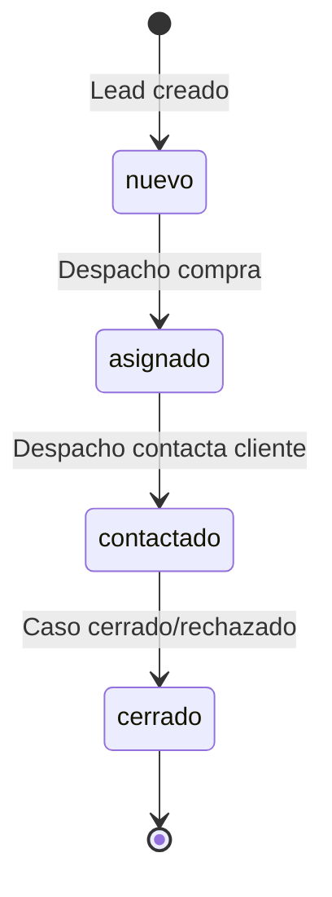
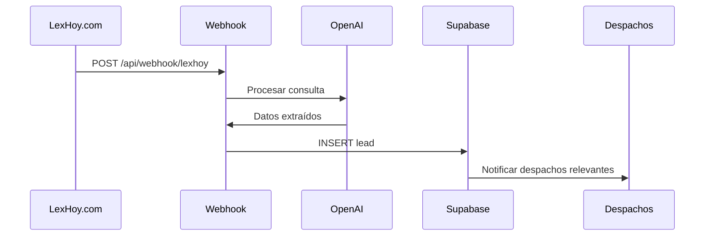
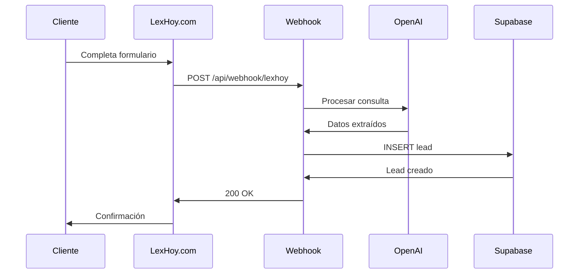
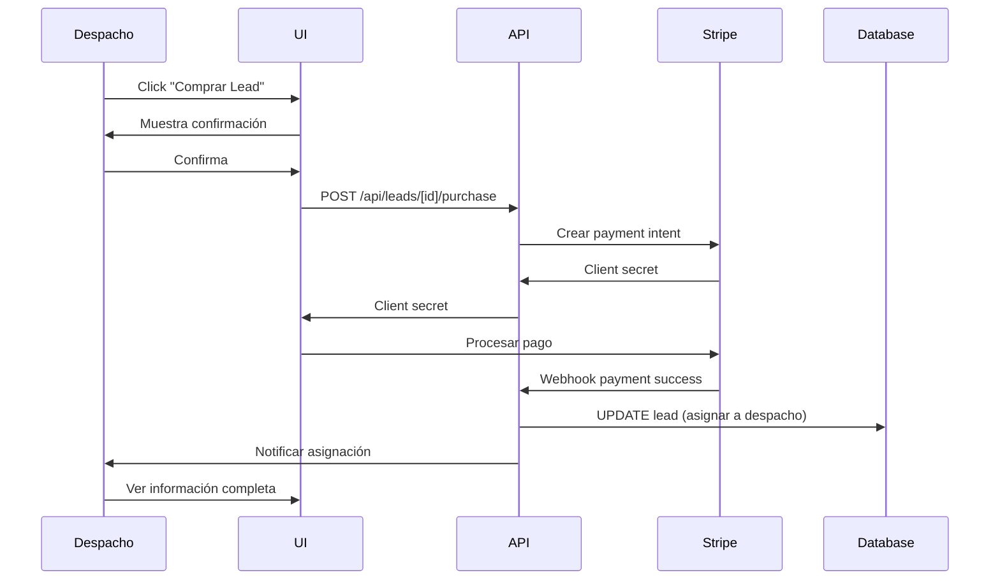

# Módulo de Leads

**Versión:** 1.0  
**Última actualización:** 2025-12-02  
**Estado:** ⚠️ Parcialmente Implementado (60%)

---

## 📋 Índice

1. [Visión General](#visión-general)
2. [¿Qué es un Lead?](#qué-es-un-lead)
3. [Procesamiento con IA](#procesamiento-con-ia)
4. [Marketplace de Leads](#marketplace-de-leads)
5. [Sistema de Compra](#sistema-de-compra)
6. [Flujos Principales](#flujos-principales)
7. [Base de Datos](#base-de-datos)
8. [API Endpoints](#api-endpoints)
9. [Estado Actual](#estado-actual)
10. [Pendientes](#pendientes)

---

## 🎯 Visión General

El módulo de leads conecta **clientes potenciales** con **despachos de abogados**. Es el core del modelo de negocio de LexHoy.

### Flujo General

```
Cliente → Formulario Web → Webhook → IA Procesa → Lead Creado → Marketplace → Despacho Compra → Contacto
```

### Tecnologías Utilizadas

- **Procesamiento IA:** OpenAI GPT-4
- **Webhooks:** Next.js API Routes
- **Base de Datos:** Supabase
- **Pagos:** Stripe (pendiente)
- **Notificaciones:** Resend (pendiente)

---

## 💡 ¿Qué es un Lead?

Un **lead** es una consulta legal de un cliente potencial que busca servicios jurídicos.

### Componentes de un Lead

```typescript
interface Lead {
  // Identificación
  id: string;
  
  // Cliente
  cliente_nombre: string;
  cliente_email: string;
  cliente_telefono?: string;
  
  // Consulta
  consulta: string;                       // Texto original
  especialidad: string;                   // Extraído por IA
  urgencia: 'baja' | 'media' | 'alta' | 'urgente';
  presupuesto_estimado?: number;
  
  // Ubicación
  provincia?: string;
  ciudad?: string;
  codigo_postal?: string;
  
  // Estado
  estado: 'nuevo' | 'asignado' | 'contactado' | 'cerrado';
  fecha_creacion: Date;
  fecha_asignacion?: Date;
  fecha_cierre?: Date;
  
  // Asignación
  despacho_id?: string;
  sede_id?: string;
  
  // Origen
  fuente: string;                         // 'web' | 'api' | 'manual'
  utm_source?: string;
  utm_medium?: string;
  utm_campaign?: string;
  
  // Seguimiento
  notas?: string;
  valoracion?: number;                    // 1-5 estrellas
  feedback?: string;
  
  // IA
  ai_processed: boolean;
  ai_confidence: number;                  // 0-1
  ai_metadata?: any;
}
```

### Estados de un Lead



---

## 🤖 Procesamiento con IA

### Flujo de Procesamiento



### Extracción con IA

**Prompt utilizado:**

```typescript
const prompt = `
Analiza la siguiente consulta legal y extrae:

1. Especialidad legal (una de: Civil, Penal, Laboral, Familia, Mercantil, Administrativo, Fiscal, Inmobiliario, Consumo, Tráfico)
2. Nivel de urgencia (baja, media, alta, urgente)
3. Presupuesto estimado (si se menciona)
4. Palabras clave relevantes

Consulta: "${consulta}"

Responde en formato JSON:
{
  "especialidad": "...",
  "urgencia": "...",
  "presupuesto_estimado": número o null,
  "palabras_clave": ["..."],
  "confidence": 0.0 a 1.0
}
`;
```

**Ejemplo de Procesamiento:**

```typescript
// Input
const consulta = "Necesito ayuda urgente con un divorcio contencioso. Mi pareja y yo tenemos hijos menores.";

// Output de IA
{
  "especialidad": "Familia",
  "urgencia": "alta",
  "presupuesto_estimado": null,
  "palabras_clave": ["divorcio", "contencioso", "hijos menores", "custodia"],
  "confidence": 0.95
}
```

### Código de Procesamiento

```typescript
async function processLeadWithAI(consulta: string) {
  const response = await openai.chat.completions.create({
    model: "gpt-4",
    messages: [
      {
        role: "system",
        content: "Eres un asistente experto en derecho español que clasifica consultas legales."
      },
      {
        role: "user",
        content: prompt
      }
    ],
    temperature: 0.3,
    response_format: { type: "json_object" }
  });
  
  const result = JSON.parse(response.choices[0].message.content);
  
  return {
    especialidad: result.especialidad,
    urgencia: result.urgencia,
    presupuesto_estimado: result.presupuesto_estimado,
    ai_metadata: {
      palabras_clave: result.palabras_clave,
      confidence: result.confidence,
      model: "gpt-4",
      processed_at: new Date()
    }
  };
}
```

---

## 🛒 Marketplace de Leads

### Ubicación

`/dashboard/leads`

### Funcionalidades

#### Para Usuarios Normales

- ✅ Ver leads disponibles (solo visualización)
- ❌ No pueden comprar (necesitan ser despacho_admin)

#### Para Despacho Admins

- ✅ Ver leads disponibles
- ✅ Filtrar por especialidad, provincia, urgencia
- ✅ Ver detalles completos
- ⚠️ Comprar leads (pendiente de implementar)
- ⚠️ Ver historial de compras (pendiente)

### Interfaz del Marketplace

```
┌─────────────────────────────────────────┐
│ Marketplace de Leads                    │
├─────────────────────────────────────────┤
│ Filtros:                                │
│ [Especialidad ▼] [Provincia ▼] [Buscar]│
├─────────────────────────────────────────┤
│ ┌─────────────────────────────────────┐ │
│ │ 🔵 Divorcio Contencioso             │ │
│ │ 📍 Madrid | ⚡ Alta | 💰 €500       │ │
│ │ "Necesito ayuda urgente..."         │ │
│ │ [Ver Detalles] [Comprar €50]        │ │
│ └─────────────────────────────────────┘ │
│ ┌─────────────────────────────────────┐ │
│ │ 🟢 Accidente de Tráfico             │ │
│ │ 📍 Barcelona | ⚡ Media | 💰 €300   │ │
│ │ "Tuve un accidente hace 2 días..."  │ │
│ │ [Ver Detalles] [Comprar €40]        │ │
│ └─────────────────────────────────────┘ │
└─────────────────────────────────────────┘
```

### Filtros Disponibles

```typescript
interface LeadFilters {
  especialidad?: string;
  provincia?: string;
  urgencia?: 'baja' | 'media' | 'alta' | 'urgente';
  fecha_desde?: Date;
  fecha_hasta?: Date;
  presupuesto_min?: number;
  presupuesto_max?: number;
  estado?: LeadStatus;
}
```

---

## 💳 Sistema de Compra

### Estado: ❌ NO IMPLEMENTADO

### Opciones Planificadas

#### Opción 1: Compra Directa

```
Lead tiene precio fijo → Despacho paga → Lead asignado inmediatamente
```

**Ventajas:**
- Simple y rápido
- Predecible para el despacho
- Fácil de implementar

**Desventajas:**
- No maximiza ingresos
- No hay competencia

#### Opción 2: Sistema de Subasta

```
Lead publicado → Despachos pujan → Temporizador → Ganador asignado
```

**Ventajas:**
- Maximiza ingresos
- Competencia entre despachos
- Leads valiosos generan más

**Desventajas:**
- Más complejo
- Requiere tiempo real
- Puede frustrar a despachos

#### Opción 3: Suscripción

```
Despacho paga mensual → Recibe X leads/mes → Prioridad en asignación
```

**Ventajas:**
- Ingresos predecibles
- Fidelización de clientes
- Flujo constante

**Desventajas:**
- Requiere gestión de cuotas
- Puede haber leads insuficientes

### Implementación Recomendada

**Fase 1:** Compra directa (MVP)
**Fase 2:** Suscripciones
**Fase 3:** Subastas para leads premium

---

## 🔄 Flujos Principales

### Flujo 1: Cliente Envía Consulta



**Endpoint del Webhook:**

```typescript
// app/api/webhook/lexhoy/route.ts
export async function POST(request: Request) {
  try {
    // 1. Verificar secret
    const secret = request.headers.get('x-webhook-secret');
    if (secret !== process.env.LEXHOY_WEBHOOK_SECRET) {
      return Response.json({ error: 'Unauthorized' }, { status: 401 });
    }
    
    // 2. Parsear datos
    const data = await request.json();
    
    // 3. Procesar con IA
    const aiResult = await processLeadWithAI(data.mensaje);
    
    // 4. Crear lead
    const { data: lead } = await supabase
      .from('leads')
      .insert({
        cliente_nombre: data.nombre,
        cliente_email: data.email,
        cliente_telefono: data.telefono,
        consulta: data.mensaje,
        provincia: data.provincia,
        especialidad: aiResult.especialidad,
        urgencia: aiResult.urgencia,
        presupuesto_estimado: aiResult.presupuesto_estimado,
        fuente: 'web',
        estado: 'nuevo',
        ai_processed: true,
        ai_confidence: aiResult.ai_metadata.confidence,
        ai_metadata: aiResult.ai_metadata
      })
      .select()
      .single();
    
    // 5. Notificar despachos relevantes
    await notifyRelevantDespachos(lead);
    
    return Response.json({ success: true, lead_id: lead.id });
    
  } catch (error) {
    console.error('Webhook error:', error);
    return Response.json({ error: 'Internal error' }, { status: 500 });
  }
}
```

### Flujo 2: Despacho Compra Lead (Planificado)



### Flujo 3: Gestión de Lead Comprado

```typescript
// Despacho marca lead como contactado
async function markAsContacted(leadId: string, notes: string) {
  await supabase
    .from('leads')
    .update({
      estado: 'contactado',
      notas: notes,
      fecha_contacto: new Date()
    })
    .eq('id', leadId);
}

// Despacho cierra lead
async function closeLead(
  leadId: string,
  valoracion: number,
  feedback: string
) {
  await supabase
    .from('leads')
    .update({
      estado: 'cerrado',
      fecha_cierre: new Date(),
      valoracion,
      feedback
    })
    .eq('id', leadId);
}
```

---

## 🗄️ Base de Datos

### Tabla: `leads`

```sql
CREATE TABLE leads (
  -- Identificación
  id UUID PRIMARY KEY DEFAULT uuid_generate_v4(),
  
  -- Cliente
  cliente_nombre TEXT NOT NULL,
  cliente_email TEXT NOT NULL,
  cliente_telefono TEXT,
  
  -- Consulta
  consulta TEXT NOT NULL,
  especialidad TEXT NOT NULL,
  urgencia TEXT,
  presupuesto_estimado DECIMAL(10,2),
  
  -- Ubicación
  provincia TEXT,
  ciudad TEXT,
  codigo_postal TEXT,
  
  -- Estado
  estado TEXT DEFAULT 'nuevo',
  fecha_creacion TIMESTAMP DEFAULT NOW(),
  fecha_asignacion TIMESTAMP,
  fecha_contacto TIMESTAMP,
  fecha_cierre TIMESTAMP,
  
  -- Asignación
  despacho_id UUID REFERENCES despachos(id),
  sede_id UUID REFERENCES sedes(id),
  
  -- Origen
  fuente TEXT DEFAULT 'web',
  utm_source TEXT,
  utm_medium TEXT,
  utm_campaign TEXT,
  
  -- Seguimiento
  notas TEXT,
  valoracion INTEGER CHECK (valoracion >= 1 AND valoracion <= 5),
  feedback TEXT,
  
  -- IA
  ai_processed BOOLEAN DEFAULT false,
  ai_confidence DECIMAL(3,2),
  ai_metadata JSONB,
  
  -- Precio y pago
  precio DECIMAL(10,2),
  pagado BOOLEAN DEFAULT false,
  stripe_payment_id TEXT,
  
  created_at TIMESTAMP DEFAULT NOW(),
  updated_at TIMESTAMP DEFAULT NOW(),
  
  CONSTRAINT valid_estado 
    CHECK (estado IN ('nuevo', 'asignado', 'contactado', 'cerrado')),
  CONSTRAINT valid_urgencia 
    CHECK (urgencia IN ('baja', 'media', 'alta', 'urgente'))
);

-- Índices
CREATE INDEX idx_leads_estado ON leads(estado);
CREATE INDEX idx_leads_especialidad ON leads(especialidad);
CREATE INDEX idx_leads_provincia ON leads(provincia);
CREATE INDEX idx_leads_despacho ON leads(despacho_id);
CREATE INDEX idx_leads_fecha ON leads(fecha_creacion DESC);
```

---

## 🔌 API Endpoints

### POST `/api/webhook/lexhoy`

**Descripción:** Recibe consultas de LexHoy.com

**Headers:**
```
x-webhook-secret: {secret}
```

**Request:**
```typescript
{
  nombre: string;
  email: string;
  telefono?: string;
  provincia?: string;
  mensaje: string;
}
```

### GET `/api/leads`

**Descripción:** Lista leads disponibles

**Query params:**
- `especialidad`
- `provincia`
- `urgencia`
- `estado`

### GET `/api/leads/[id]`

**Descripción:** Obtiene un lead específico

**Nota:** Solo muestra información completa si el lead está asignado al despacho del usuario

### POST `/api/leads/[id]/purchase` (Pendiente)

**Descripción:** Compra un lead

### PUT `/api/leads/[id]/status`

**Descripción:** Actualiza estado del lead

**Request:**
```typescript
{
  estado: 'contactado' | 'cerrado';
  notas?: string;
  valoracion?: number;
  feedback?: string;
}
```

---

## ✅ Estado Actual

### Implementado

- [x] Estructura de base de datos
- [x] Webhook endpoint
- [x] Procesamiento con IA
- [x] Creación de leads
- [x] Marketplace básico (visualización)
- [x] Filtros de leads
- [x] Panel de admin para leads

### Funcionando

- ✅ Recepción de webhooks
- ✅ Procesamiento con OpenAI
- ✅ Almacenamiento en BD
- ✅ Visualización en marketplace

---

## 🚧 Pendientes

### Crítico

- [ ] **Integración con LexHoy.com**
  - [ ] Configurar webhook en WordPress
  - [ ] Probar flujo end-to-end
  - [ ] Validar procesamiento

- [ ] **Sistema de Compra**
  - [ ] Integrar Stripe
  - [ ] Lógica de compra
  - [ ] Procesamiento de pagos
  - [ ] Confirmaciones

### Alto

- [ ] **Notificaciones**
  - [ ] Email a despachos relevantes
  - [ ] Notificación de nuevo lead
  - [ ] Notificación de asignación

- [ ] **Gestión de Leads Comprados**
  - [ ] Página "Mis Leads"
  - [ ] Marcar como contactado
  - [ ] Cerrar lead
  - [ ] Valorar lead

### Medio

- [ ] **Analytics**
  - [ ] Dashboard de métricas
  - [ ] Tasa de conversión
  - [ ] ROI por despacho

- [ ] **Mejoras de IA**
  - [ ] Mejorar precisión
  - [ ] Detectar spam
  - [ ] Clasificación más granular

---

**Última actualización:** 2025-12-02  
**Mantenido por:** José Ramón Blanco Casal
