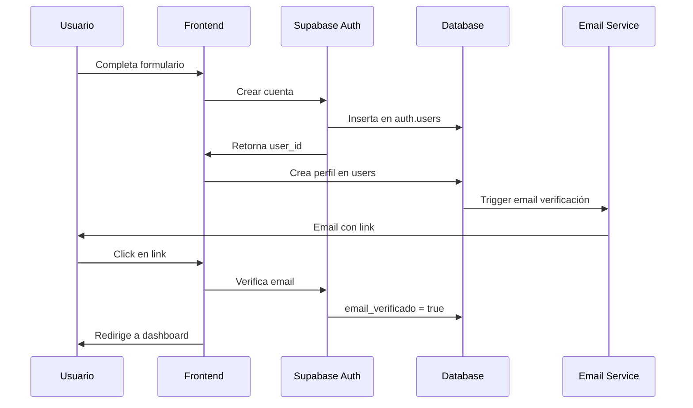
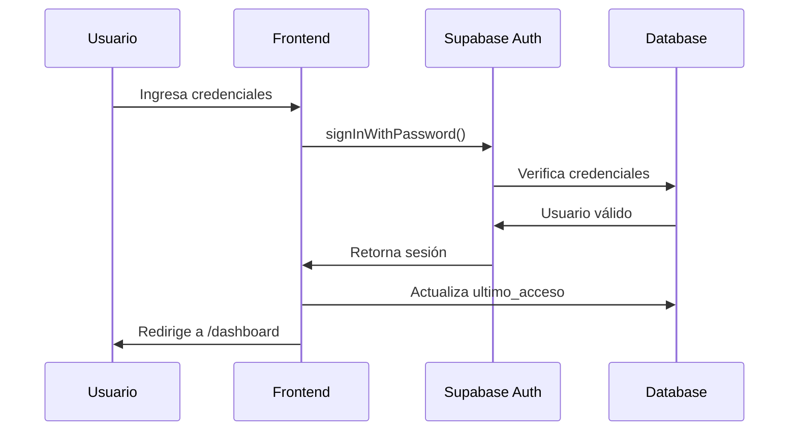
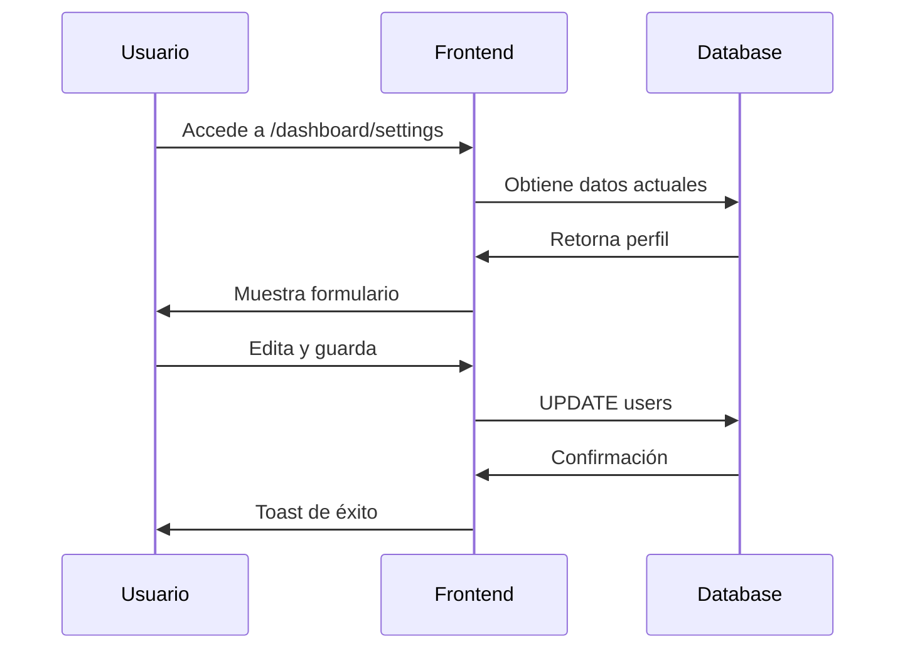
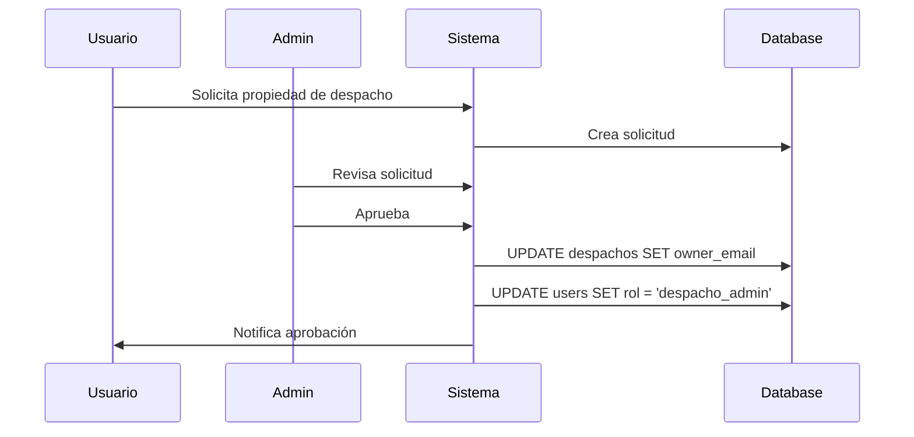
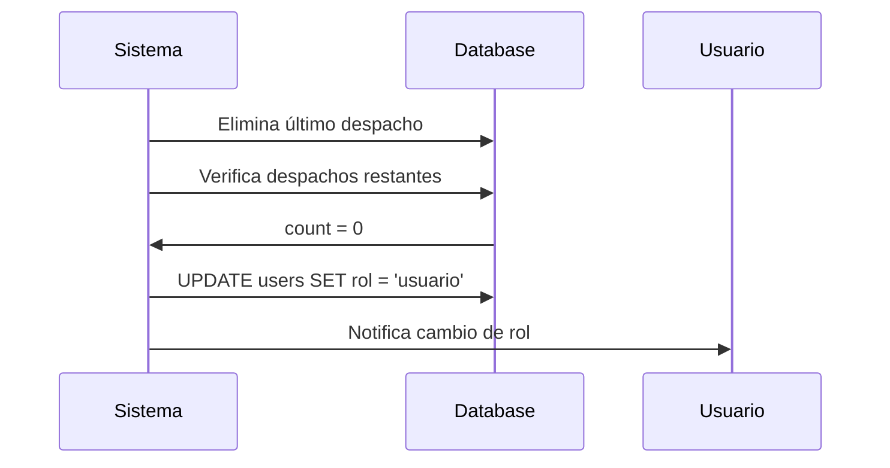

# Módulo de Usuarios

**Versión:** 1.0  
**Última actualización:** 2025-12-02  
**Estado:** ✅ Implementado (90%)

---

## 📋 Índice

1. [Visión General](#visión-general)
2. [Roles de Usuario](#roles-de-usuario)
3. [Flujos de Usuario](#flujos-de-usuario)
4. [Base de Datos](#base-de-datos)
5. [API Endpoints](#api-endpoints)
6. [Componentes](#componentes)
7. [Estado Actual](#estado-actual)
8. [Pendientes](#pendientes)

---

## 🎯 Visión General

El módulo de usuarios gestiona todo lo relacionado con:
- Registro y autenticación de usuarios
- Gestión de perfiles
- Sistema de roles y permisos
- Promoción/degradación de roles
- Gestión de sesiones

### Tecnologías Utilizadas

- **Autenticación:** Supabase Auth
- **Base de Datos:** Supabase PostgreSQL
- **Frontend:** Next.js 14 + React
- **Estado:** React Context API

---

## 👥 Roles de Usuario

### 1. Usuario (`usuario`)

**Descripción:** Rol por defecto para todos los nuevos usuarios.

**Permisos:**
- ✅ Ver su perfil
- ✅ Editar su información personal
- ✅ Ver leads disponibles en marketplace (solo visualización)
- ✅ Solicitar propiedad de despachos
- ❌ No puede crear despachos
- ❌ No puede comprar leads
- ❌ No puede gestionar otros usuarios

**Casos de uso:**
- Abogado individual buscando despacho
- Usuario explorando la plataforma
- Persona interesada en reclamar su despacho

### 2. Despacho Admin (`despacho_admin`)

**Descripción:** Usuario que tiene asignado al menos un despacho.

**Permisos:**
- ✅ Todos los permisos de `usuario`
- ✅ Gestionar su(s) despacho(s)
- ✅ Ver y comprar leads
- ✅ Gestionar sedes del despacho
- ✅ Ver analytics del despacho
- ✅ Gestionar información del despacho
- ❌ No puede gestionar otros despachos
- ❌ No puede acceder al panel de administración

**Casos de uso:**
- Propietario de despacho
- Administrador de despacho
- Responsable de marketing del despacho

**Cómo se obtiene este rol:**

1. **Opción A: Solicitud de Propiedad Aprobada**
   ```
   Usuario solicita → Admin aprueba → owner_email asignado → Promoción automática
   ```

2. **Opción B: Asignación Manual por Admin**
   ```
   Admin asigna despacho → user_despachos creado → Promoción automática
   ```

### 3. Super Admin (`super_admin`)

**Descripción:** Administrador del sistema con acceso total.

**Permisos:**
- ✅ Acceso total al sistema
- ✅ Gestionar todos los usuarios
- ✅ Gestionar todos los despachos
- ✅ Aprobar/rechazar solicitudes
- ✅ Ver analytics globales
- ✅ Gestionar leads
- ✅ Configurar sistema
- ✅ Acceso al panel de administración

**Casos de uso:**
- Administrador de la plataforma
- Soporte técnico
- Gestión de contenido

---

## 🔄 Flujos de Usuario

### Flujo 1: Registro de Usuario



**Pasos detallados:**

1. **Usuario accede a `/register`**
   - Formulario de registro se muestra
   - Campos: email, password, nombre, apellidos, teléfono

2. **Usuario completa formulario**
   - Validación en frontend
   - Email debe ser válido
   - Contraseña mínimo 8 caracteres
   - Todos los campos obligatorios

3. **Sistema crea cuenta**
   ```typescript
   // En Supabase Auth
   const { data, error } = await supabase.auth.signUp({
     email,
     password,
     options: {
       data: {
         nombre,
         apellidos,
         telefono
       }
     }
   });
   ```

4. **Sistema crea perfil**
   ```typescript
   // En tabla users
   await supabase.from('users').insert({
     id: data.user.id,
     email,
     nombre,
     apellidos,
     telefono,
     rol: 'usuario',
     estado: 'pendiente',
     email_verificado: false
   });
   ```

5. **Email de verificación enviado**
   - Supabase envía automáticamente
   - Link válido por 24 horas

6. **Usuario verifica email**
   - Click en link del email
   - `email_verificado` cambia a `true`
   - `estado` cambia a `activo`

### Flujo 2: Login



**Validaciones:**
- ✅ Email debe existir
- ✅ Contraseña debe ser correcta
- ✅ Email debe estar verificado
- ✅ Usuario debe estar activo

**Manejo de errores:**
- Email no existe → "Credenciales incorrectas"
- Contraseña incorrecta → "Credenciales incorrectas"
- Email no verificado → "Por favor verifica tu email"
- Usuario inactivo → "Tu cuenta está desactivada"

### Flujo 3: Editar Perfil



**Campos editables:**
- Nombre
- Apellidos
- Teléfono
- Localidad
- Provincia

**Campos NO editables:**
- Email (requiere proceso especial)
- Rol (solo admin puede cambiar)
- Estado (solo admin puede cambiar)

### Flujo 4: Promoción a despacho_admin



**Trigger automático:**
```sql
-- Cuando se asigna owner_email
CREATE OR REPLACE FUNCTION promote_to_despacho_admin()
RETURNS TRIGGER AS $$
BEGIN
  UPDATE users
  SET rol = 'despacho_admin'
  WHERE email = NEW.owner_email
  AND rol = 'usuario';
  RETURN NEW;
END;
$$ LANGUAGE plpgsql;
```

### Flujo 5: Degradación a usuario

**Condición:** Usuario pierde su último despacho



**Lógica de verificación:**
```typescript
async function checkAndDemoteUser(userId: string) {
  // Contar despachos owned
  const { count: ownedCount } = await supabase
    .from('despachos')
    .select('*', { count: 'exact', head: true })
    .eq('owner_email', userEmail);
  
  // Contar asignaciones activas
  const { count: assignedCount } = await supabase
    .from('user_despachos')
    .select('*', { count: 'exact', head: true })
    .eq('user_id', userId)
    .eq('activo', true);
  
  const totalDespachos = ownedCount + assignedCount;
  
  if (totalDespachos === 0) {
    await supabase
      .from('users')
      .update({ rol: 'usuario' })
      .eq('id', userId);
  }
}
```

---

## 🗄️ Base de Datos

### Tabla: `users`

```sql
CREATE TABLE users (
  -- Identificación
  id UUID PRIMARY KEY,                    -- UUID de Supabase Auth
  email TEXT UNIQUE NOT NULL,
  
  -- Información personal
  nombre TEXT NOT NULL,
  apellidos TEXT NOT NULL,
  telefono TEXT,
  localidad TEXT,
  provincia TEXT,
  
  -- Fechas
  fecha_registro TIMESTAMP DEFAULT NOW(),
  ultimo_acceso TIMESTAMP,
  
  -- Estado
  activo BOOLEAN DEFAULT true,
  email_verificado BOOLEAN DEFAULT false,
  
  -- Plan y rol
  plan TEXT DEFAULT 'basico',             -- basico | profesional | enterprise
  rol TEXT DEFAULT 'usuario',             -- usuario | despacho_admin | super_admin
  estado TEXT DEFAULT 'pendiente',        -- pendiente | activo | inactivo | suspendido
  
  -- Administración
  fecha_aprobacion TIMESTAMP,
  aprobado_por UUID REFERENCES users(id),
  notas_admin TEXT,
  
  -- Timestamps
  created_at TIMESTAMP DEFAULT NOW(),
  updated_at TIMESTAMP DEFAULT NOW()
);

-- Índices
CREATE INDEX idx_users_email ON users(email);
CREATE INDEX idx_users_rol ON users(rol);
CREATE INDEX idx_users_estado ON users(estado);
```

### Políticas RLS (Row Level Security)

```sql
-- Los usuarios pueden ver su propio perfil
CREATE POLICY "Users can view own profile"
ON users FOR SELECT
USING (auth.uid() = id);

-- Los usuarios pueden actualizar su propio perfil
CREATE POLICY "Users can update own profile"
ON users FOR UPDATE
USING (auth.uid() = id)
WITH CHECK (auth.uid() = id);

-- Super admins pueden ver todos los usuarios
CREATE POLICY "Super admins can view all users"
ON users FOR SELECT
USING (
  EXISTS (
    SELECT 1 FROM users
    WHERE id = auth.uid()
    AND rol = 'super_admin'
  )
);

-- Super admins pueden actualizar cualquier usuario
CREATE POLICY "Super admins can update any user"
ON users FOR UPDATE
USING (
  EXISTS (
    SELECT 1 FROM users
    WHERE id = auth.uid()
    AND rol = 'super_admin'
  )
);
```

---

## 🔌 API Endpoints

### POST `/api/auth/register`

**Descripción:** Registra un nuevo usuario

**Request:**
```typescript
{
  email: string;
  password: string;
  nombre: string;
  apellidos: string;
  telefono?: string;
}
```

**Response:**
```typescript
{
  success: boolean;
  data?: {
    user: {
      id: string;
      email: string;
    }
  };
  error?: string;
}
```

### POST `/api/auth/login`

**Descripción:** Inicia sesión

**Request:**
```typescript
{
  email: string;
  password: string;
}
```

**Response:**
```typescript
{
  success: boolean;
  data?: {
    user: User;
    session: Session;
  };
  error?: string;
}
```

### GET `/api/users/profile`

**Descripción:** Obtiene perfil del usuario actual

**Headers:**
```
Authorization: Bearer {token}
```

**Response:**
```typescript
{
  id: string;
  email: string;
  nombre: string;
  apellidos: string;
  telefono?: string;
  rol: string;
  estado: string;
  // ... más campos
}
```

### PUT `/api/users/profile`

**Descripción:** Actualiza perfil del usuario

**Request:**
```typescript
{
  nombre?: string;
  apellidos?: string;
  telefono?: string;
  localidad?: string;
  provincia?: string;
}
```

**Response:**
```typescript
{
  success: boolean;
  data?: User;
  error?: string;
}
```

### GET `/api/admin/users` (Super Admin only)

**Descripción:** Lista todos los usuarios

**Query params:**
- `rol`: Filtrar por rol
- `estado`: Filtrar por estado
- `search`: Buscar por email/nombre
- `page`: Número de página
- `limit`: Resultados por página

**Response:**
```typescript
{
  users: User[];
  total: number;
  page: number;
  totalPages: number;
}
```

---

## 🧩 Componentes

### `UserProfile.tsx`

**Ubicación:** `components/users/UserProfile.tsx`

**Props:**
```typescript
interface UserProfileProps {
  user: User;
  editable?: boolean;
  onUpdate?: (user: User) => void;
}
```

**Uso:**
```tsx
<UserProfile 
  user={currentUser} 
  editable={true}
  onUpdate={handleUserUpdate}
/>
```

### `UserList.tsx` (Admin)

**Ubicación:** `components/admin/UserList.tsx`

**Props:**
```typescript
interface UserListProps {
  users: User[];
  onEdit?: (user: User) => void;
  onDelete?: (userId: string) => void;
}
```

### `RoleBadge.tsx`

**Ubicación:** `components/users/RoleBadge.tsx`

**Props:**
```typescript
interface RoleBadgeProps {
  rol: 'usuario' | 'despacho_admin' | 'super_admin';
}
```

**Renderizado:**
- `usuario` → Badge azul
- `despacho_admin` → Badge verde
- `super_admin` → Badge rojo

---

## ✅ Estado Actual

### Implementado

- [x] Registro de usuarios
- [x] Login/Logout
- [x] Verificación de email
- [x] Recuperación de contraseña
- [x] Edición de perfil
- [x] Sistema de roles
- [x] Promoción/degradación automática
- [x] Panel de usuario
- [x] Gestión de usuarios (admin)
- [x] Políticas RLS

### Funcionando Correctamente

- ✅ Autenticación con Supabase
- ✅ Persistencia de sesión
- ✅ Cambio de roles automático
- ✅ Restricciones de acceso por rol
- ✅ Validación de formularios

---

## 🚧 Pendientes

### Funcionalidades

- [ ] **Autenticación social**
  - Google OAuth
  - LinkedIn OAuth
  - GitHub OAuth

- [ ] **Verificación en dos pasos (2FA)**
  - SMS
  - Authenticator app

- [ ] **Gestión avanzada de permisos**
  - Permisos granulares
  - Roles personalizados

- [ ] **Historial de actividad**
  - Log de acciones del usuario
  - Auditoría de cambios

### Mejoras

- [ ] **Validación de teléfono**
  - Verificar número de teléfono
  - SMS de confirmación

- [ ] **Avatar de usuario**
  - Upload de imagen
  - Crop y resize
  - Storage en Supabase

- [ ] **Preferencias de usuario**
  - Idioma
  - Zona horaria
  - Notificaciones

- [ ] **Exportar datos**
  - GDPR compliance
  - Descarga de datos personales

---

## 🧪 Testing

### Tests Unitarios

```typescript
// tests/unit/userService.test.ts
describe('UserService', () => {
  it('should create user with default role', async () => {
    const user = await createUser({
      email: 'test@example.com',
      password: 'password123',
      nombre: 'Test',
      apellidos: 'User'
    });
    
    expect(user.rol).toBe('usuario');
    expect(user.estado).toBe('pendiente');
  });
  
  it('should promote user to despacho_admin when despacho assigned', async () => {
    // Test implementation
  });
});
```

### Tests de Integración

```typescript
// tests/integration/auth.test.ts
describe('Authentication Flow', () => {
  it('should complete full registration flow', async () => {
    // 1. Register
    // 2. Verify email
    // 3. Login
    // 4. Access dashboard
  });
});
```

---

## 📚 Referencias

- [Supabase Auth Docs](https://supabase.com/docs/guides/auth)
- [Next.js Authentication](https://nextjs.org/docs/authentication)
- [RLS Policies](https://supabase.com/docs/guides/auth/row-level-security)

---

**Última actualización:** 2025-12-02  
**Mantenido por:** José Ramón Blanco Casal
