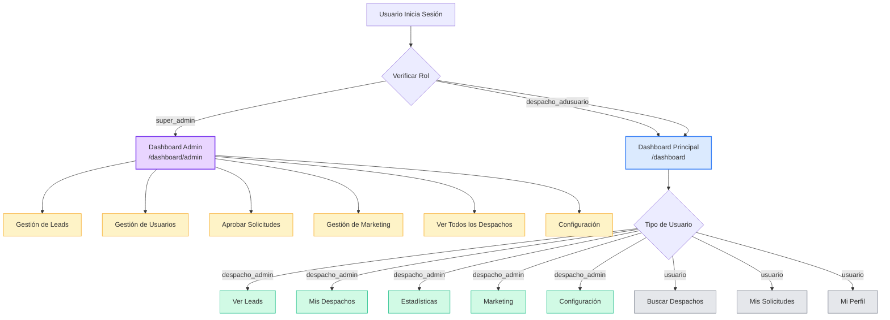

# 🔄 Diagrama de Flujo de Usuarios - LexHoy

## Arquitectura de Roles y Navegación



## Permisos por Rol

### 🛡️ Super Admin (`super_admin`)

**Acceso Completo al Sistema**

| Funcionalidad | Permiso | Ruta |
|--------------|---------|------|
| Dashboard Admin | ✅ Completo | `/dashboard/admin` |
| Gestión de Leads | ✅ Ver/Editar/Eliminar TODOS | `/dashboard/admin/listado-leads` |
| Gestión de Usuarios | ✅ Crear/Editar/Eliminar | `/dashboard/admin/users` |
| Aprobar Solicitudes | ✅ Aprobar/Rechazar | `/dashboard/admin/users/solicitudes` |
| Gestión de Despachos | ✅ Ver/Editar TODOS | `/dashboard/despachos` |
| Marketing | ✅ Gestión completa | `/dashboard/admin/marketing` |
| Estadísticas Globales | ✅ Ver todas | `/dashboard/admin` |
| Configuración | ✅ Sistema + Personal | `/dashboard/settings` |

**Restricciones:** Ninguna

---

### 👔 Admin Despacho (`despacho_admin`)

**Gestión de Sus Propios Despachos**

| Funcionalidad | Permiso | Ruta |
|--------------|---------|------|
| Dashboard Principal | ✅ Completo | `/dashboard` |
| Ver Leads | ✅ Solo de sus despachos | `/dashboard/leads` |
| Mis Despachos | ✅ Ver/Editar propios | `/dashboard/despachos` |
| Gestión de Sedes | ✅ Crear/Editar/Eliminar | `/dashboard/despachos/[slug]` |
| Estadísticas | ✅ Solo de sus despachos | `/dashboard` |
| Marketing | ✅ Ver contenido | `/dashboard/marketing` |
| Solicitar Despachos | ✅ Solicitar nuevos | `/dashboard/despachos` |
| Configuración | ✅ Solo personal | `/dashboard/settings` |

**Restricciones:**
- ❌ No puede ver leads de otros despachos
- ❌ No puede gestionar usuarios
- ❌ No puede aprobar solicitudes
- ❌ No puede ver estadísticas globales

---

### 👤 Usuario (`usuario`)

**Acceso Básico**

| Funcionalidad | Permiso | Ruta |
|--------------|---------|------|
| Dashboard Principal | ✅ Limitado | `/dashboard` |
| Buscar Despachos | ✅ Ver todos | `/dashboard/despachos` |
| Solicitar Despacho | ✅ Crear solicitudes | `/dashboard/despachos` |
| Mis Solicitudes | ✅ Ver propias | `/dashboard/settings?tab=solicitudes` |
| Mi Perfil | ✅ Editar propio | `/dashboard/settings` |

**Restricciones:**
- ❌ No puede ver leads
- ❌ No puede gestionar despachos
- ❌ No puede ver estadísticas
- ❌ No puede acceder a marketing
- ❌ Solo puede solicitar acceso a despachos

---

## Middleware de Protección

### Rutas Públicas (Sin Autenticación)
```typescript
[
  "/",
  "/sobre-nosotros",
  "/contacto",
  "/servicios",
  "/servicios/(.*)",
  "/sign-in(.*)",
  "/sign-up(.*)",
  "/api/webhooks/clerk",
  "/api/webhooks/lexhoy",
]
```

### Rutas Protegidas

#### Solo Super Admin
```typescript
["/admin(.*)", "/dashboard/admin(.*)"]
```
- Middleware verifica `user.rol === "super_admin"`
- Redirige a `/dashboard` si no es super admin

#### Usuarios Autenticados
```typescript
["/dashboard(.*)"]
```
- Requiere autenticación con Clerk
- Redirige a `/sign-in` si no está autenticado

---

## Flujo de Redirección

### Al Iniciar Sesión

```
Usuario autenticado
    ↓
Middleware verifica rol
    ↓
┌─────────────────┬──────────────────┬─────────────────┐
│  super_admin    │  despacho_admin  │    usuario      │
│       ↓         │        ↓         │       ↓         │
│ /dashboard/admin│   /dashboard     │  /dashboard     │
└─────────────────┴──────────────────┴─────────────────┘
```

### Intentando Acceder a Ruta Admin

```
Usuario intenta acceder a /dashboard/admin
    ↓
Middleware verifica rol
    ↓
┌─────────────────┬──────────────────────────────┐
│  super_admin    │  despacho_admin / usuario    │
│       ↓         │             ↓                │
│   ✅ Permitir   │  ❌ Redirigir a /dashboard   │
└─────────────────┴──────────────────────────────┘
```

---

## Componentes de Navegación

### Sidebar
- **Ubicación:** `components/Sidebar.tsx`
- **Comportamiento:** Muestra menú diferente según rol
- **Indicador de Rol:** Badge visual mostrando rol actual

### Breadcrumbs
- **Ubicación:** `components/dashboard/shared/Breadcrumbs.tsx`
- **Comportamiento:** Genera automáticamente según ruta actual
- **Visibilidad:** Oculto en páginas principales de dashboard

---

## Componentes Compartidos

### Ubicación
```
components/dashboard/shared/
├── StatCard.tsx          # Tarjetas de estadísticas
├── QuickActionCard.tsx   # Tarjetas de acciones rápidas
├── Breadcrumbs.tsx       # Navegación breadcrumb
└── index.ts              # Barrel export
```

### Uso
```typescript
import { StatCard, QuickActionCard, Breadcrumbs } from "@/components/dashboard/shared";
```

---

## Mejoras Implementadas

### ✅ Fase 1 Completada
1. **Componentes Compartidos**
   - Eliminadas ~170 líneas de código duplicado
   - Componentes reutilizables entre dashboards
   
2. **Navegación Mejorada**
   - Breadcrumbs automáticos
   - Indicador visual de rol
   - Transiciones suaves

3. **TypeScript**
   - Compilación sin errores
   - Tipos bien definidos

---

## Próximos Pasos

### Fase 2: Funcionalidades Pendientes
- [ ] Resolver TODOs críticos
- [ ] Implementar funcionalidades faltantes (GDPR, sesiones, etc.)

### Fase 3: Optimización
- [ ] Code splitting por rol
- [ ] Lazy loading de componentes
- [ ] Tests E2E
