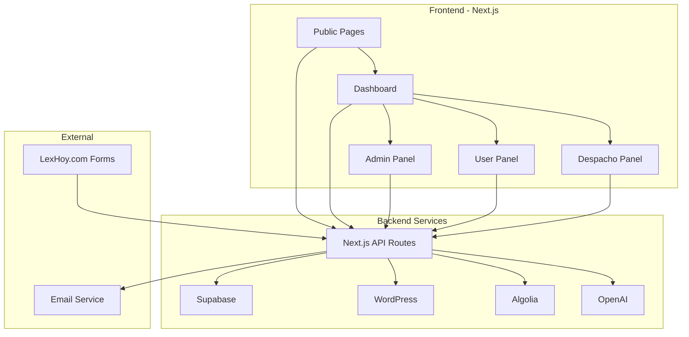
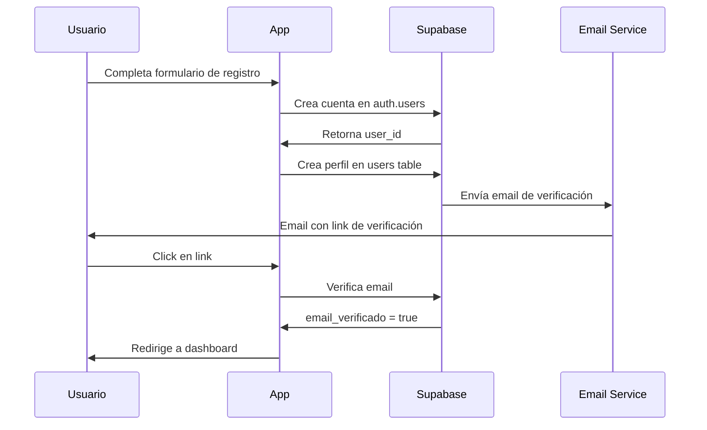
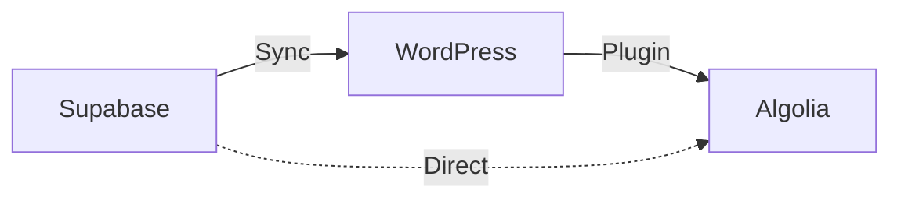
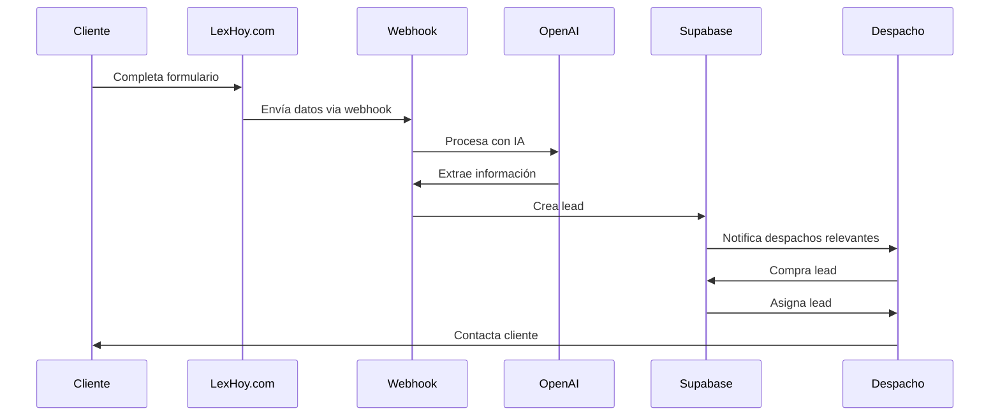
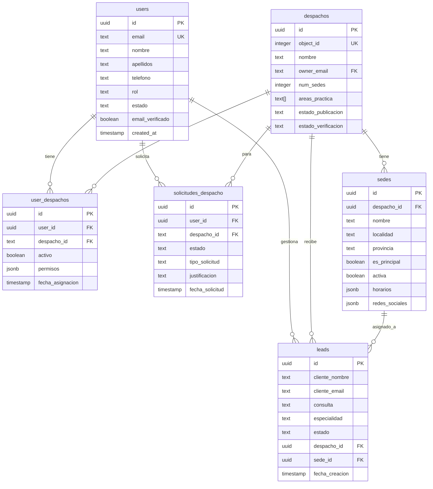

# Documentación Maestra - Aplicación LexHoy

**Versión:** 2.0  
**Fecha:** 2025-12-02  
**Estado:** Documento Maestro - Referencia Principal

---

## 📋 Tabla de Contenidos

1. [Visión General del Proyecto](#visión-general)
2. [Arquitectura del Sistema](#arquitectura)
3. [Módulo de Usuarios](#módulo-usuarios)
4. [Módulo de Despachos](#módulo-despachos)
5. [Módulo de Leads](#módulo-leads)
6. [Módulo de Marketing](#módulo-marketing)
7. [Base de Datos](#base-de-datos)
8. [Flujos de Usuario](#flujos-de-usuario)
9. [Estado Actual del Desarrollo](#estado-actual)
10. [Funcionalidades Pendientes](#funcionalidades-pendientes)
11. [Plan de Testing](#plan-de-testing)
12. [Roadmap](#roadmap)

---

## 🎯 Visión General del Proyecto {#visión-general}

### Descripción

LexHoy es una plataforma integral para conectar despachos de abogados con clientes potenciales. La aplicación gestiona:

- **Registro y gestión de despachos** de abogados
- **Sistema de leads** para conectar clientes con abogados
- **Marketplace de leads** donde los despachos pueden adquirir consultas
- **Panel de administración** para super administradores
- **Sistema de marketing** para campañas y promociones

### Stack Tecnológico

```
Frontend:
├─ Next.js 14 (App Router)
├─ React 18
├─ TypeScript
├─ TailwindCSS
└─ Sonner (Toasts)

Backend:
├─ Next.js API Routes
├─ Supabase (Base de Datos + Auth)
├─ WordPress (CMS para contenido público)
└─ Algolia (Búsqueda)

Integraciones:
├─ OpenAI (Procesamiento de leads)
├─ Resend (Emails)
└─ Vercel (Hosting)
```

### URLs del Proyecto

- **Aplicación Next.js:** https://lexhoyweb.vercel.app
- **WordPress:** https://lexhoy.com
- **Repositorio:** https://github.com/V1ch1/lexhoyweb

---

## 🏗️ Arquitectura del Sistema {#arquitectura}

### Diagrama de Arquitectura



### Estructura de Directorios

```
lexhoyweb/
├── app/                          # Next.js App Router
│   ├── api/                      # API Routes
│   │   ├── admin/                # Endpoints de administración
│   │   ├── despachos/            # CRUD de despachos
│   │   ├── leads/                # Gestión de leads
│   │   ├── users/                # Gestión de usuarios
│   │   └── webhook/              # Webhooks externos
│   ├── dashboard/                # Panel de usuario
│   │   ├── admin/                # Panel de super admin
│   │   ├── despachos/            # Gestión de despachos
│   │   ├── leads/                # Marketplace de leads
│   │   ├── marketing/            # Campañas
│   │   └── settings/             # Configuración
│   ├── auth/                     # Autenticación
│   └── (public pages)/           # Páginas públicas
├── components/                   # Componentes React
│   ├── admin/                    # Componentes de admin
│   ├── despachos/                # Componentes de despachos
│   ├── leads/                    # Componentes de leads
│   └── ui/                       # Componentes UI reutilizables
├── lib/                          # Utilidades y servicios
│   ├── services/                 # Servicios de negocio
│   ├── supabase.ts               # Cliente de Supabase
│   ├── types.ts                  # Tipos TypeScript
│   └── authContext.tsx           # Contexto de autenticación
├── scripts/                      # Scripts de mantenimiento
│   ├── audit-ownership-system.ts # Auditoría de ownership
│   ├── cleanup-orphaned-assignments.ts
│   └── sync-user-roles.ts        # Sincronización de roles
└── docs/                         # Documentación
```

---

## 👥 Módulo de Usuarios {#módulo-usuarios}

### Roles de Usuario

#### 1. **Usuario** (rol: `usuario`)

**Permisos:**
- ✅ Ver su perfil
- ✅ Editar su información personal
- ✅ Ver leads disponibles en el marketplace
- ✅ Solicitar propiedad de un despacho
- ❌ No puede crear despachos
- ❌ No puede comprar leads (necesita ser despacho_admin)

**Flujo de Registro:**



**Campos del Usuario:**

```typescript
interface User {
  id: string;                    // UUID de Supabase
  email: string;                 // Email único
  nombre: string;
  apellidos: string;
  telefono?: string;
  localidad?: string;
  provincia?: string;
  fechaRegistro: Date;
  ultimoAcceso?: Date;
  activo: boolean;               // true/false
  emailVerificado: boolean;
  plan: 'basico' | 'profesional' | 'enterprise';
  rol: 'usuario' | 'despacho_admin' | 'super_admin';
  estado: 'pendiente' | 'activo' | 'inactivo' | 'suspendido';
}
```

#### 2. **Despacho Admin** (rol: `despacho_admin`)

**Permisos:**
- ✅ Todos los permisos de usuario
- ✅ Gestionar su(s) despacho(s)
- ✅ Ver y comprar leads
- ✅ Gestionar sedes del despacho
- ✅ Ver analytics del despacho
- ❌ No puede gestionar otros despachos
- ❌ No puede acceder al panel de administración

**Cómo se convierte en despacho_admin:**

1. **Opción A: Solicitud de Propiedad**
   - Usuario solicita propiedad de un despacho existente
   - Super admin aprueba la solicitud
   - Sistema asigna `owner_email` en tabla `despachos`
   - Sistema promociona automáticamente a `despacho_admin`

2. **Opción B: Asignación Manual**
   - Super admin asigna manualmente un despacho al usuario
   - Sistema crea relación en `user_despachos`
   - Sistema promociona a `despacho_admin`

**Ownership vs Asignación:**

```typescript
// Ownership (Sistema Principal)
despachos.owner_email = "usuario@email.com"  // 1 despacho = 1 owner

// Asignación Manual (Sistema Secundario - Colaboradores)
user_despachos {
  user_id: "uuid",
  despacho_id: "object_id",
  activo: true,
  permisos: { leer: true, escribir: true, eliminar: false }
}
```

#### 3. **Super Admin** (rol: `super_admin`)

**Permisos:**
- ✅ Acceso total al sistema
- ✅ Gestionar todos los usuarios
- ✅ Gestionar todos los despachos
- ✅ Aprobar/rechazar solicitudes
- ✅ Ver analytics globales
- ✅ Gestionar leads
- ✅ Configurar sistema

### Proceso de Registro Completo

**1. Usuario se Registra:**

```
Formulario de Registro
├─ Email
├─ Contraseña
├─ Nombre
├─ Apellidos
├─ Teléfono
└─ Aceptar términos

↓

Supabase Auth crea cuenta
├─ auth.users (tabla de autenticación)
└─ Envía email de verificación

↓

App crea perfil
├─ users table
├─ rol: "usuario"
├─ estado: "pendiente"
└─ emailVerificado: false

↓

Usuario verifica email
└─ emailVerificado: true
```

**2. Usuario Solicita Propiedad de Despacho:**

```
Dashboard → Ver Despachos → Solicitar Propiedad
├─ Selecciona despacho sin owner
├─ Completa formulario de justificación
├─ Adjunta documentos (opcional)
└─ Envía solicitud

↓

Sistema crea solicitud
├─ solicitudes_despacho table
├─ estado: "pendiente"
└─ Notifica a super admin

↓

Super Admin Revisa
├─ Aprueba → owner_email asignado + rol: despacho_admin
└─ Rechaza → Notifica al usuario
```

**3. Despacho Admin Gestiona su Despacho:**

```
Dashboard → Mis Despachos → [Nombre del Despacho]
├─ Ver información general
├─ Editar datos del despacho
├─ Gestionar sedes
│   ├─ Añadir nueva sede
│   ├─ Editar sede existente
│   ├─ Marcar sede principal
│   └─ Eliminar sede
├─ Ver leads asignados
├─ Comprar nuevos leads
└─ Ver analytics
```

### Tabla de Base de Datos: `users`

```sql
CREATE TABLE users (
  id UUID PRIMARY KEY,                    -- UUID de Supabase Auth
  email TEXT UNIQUE NOT NULL,
  nombre TEXT NOT NULL,
  apellidos TEXT NOT NULL,
  telefono TEXT,
  localidad TEXT,
  provincia TEXT,
  fecha_registro TIMESTAMP DEFAULT NOW(),
  ultimo_acceso TIMESTAMP,
  activo BOOLEAN DEFAULT true,
  email_verificado BOOLEAN DEFAULT false,
  plan TEXT DEFAULT 'basico',             -- basico | profesional | enterprise
  rol TEXT DEFAULT 'usuario',             -- usuario | despacho_admin | super_admin
  estado TEXT DEFAULT 'pendiente',        -- pendiente | activo | inactivo | suspendido
  fecha_aprobacion TIMESTAMP,
  aprobado_por UUID,
  notas_admin TEXT,
  created_at TIMESTAMP DEFAULT NOW(),
  updated_at TIMESTAMP DEFAULT NOW()
);
```

---

## 🏢 Módulo de Despachos {#módulo-despachos}

### Estructura de Despachos

Un despacho puede tener **múltiples sedes** (oficinas). Cada despacho tiene:

- **1 sede principal** (obligatorio)
- **N sedes adicionales** (opcional)

### Sistema de Ownership Único

**Regla Principal:** 1 Despacho = 1 Owner

```typescript
// Tabla: despachos
{
  id: "uuid",
  object_id: 74971,              // ID de WordPress
  nombre: "Vento Abogados & Asesores",
  owner_email: "blancocasal@gmail.com",  // ← ÚNICO OWNER
  num_sedes: 3,
  estado_publicacion: "publish",
  estado_verificacion: "verificado"
}
```

### Flujo de Gestión de Despachos

**1. Creación de Despacho (Super Admin):**

```
Admin Panel → Despachos → Crear Nuevo
├─ Información básica
│   ├─ Nombre del despacho
│   ├─ Descripción
│   └─ Áreas de práctica
├─ Sede principal (obligatorio)
│   ├─ Nombre de la sede
│   ├─ Dirección completa
│   ├─ Teléfono
│   ├─ Email
│   └─ Persona de contacto
└─ Owner (opcional)
    └─ Email del propietario

↓

Sistema crea despacho
├─ Registro en Supabase (despachos table)
├─ Sincroniza con WordPress
├─ Sincroniza con Algolia
└─ Crea sede principal (sedes table)
```

**2. Gestión de Sedes:**

```
Despacho Admin → Mi Despacho → Sedes
├─ Ver todas las sedes
├─ Añadir nueva sede
│   ├─ Completa formulario de sede
│   ├─ Marca si es principal
│   └─ Guarda
├─ Editar sede existente
│   ├─ Modifica información
│   └─ Sincroniza cambios
├─ Cambiar sede principal
│   └─ Solo puede haber 1 principal
└─ Eliminar sede
    └─ No se puede eliminar si es la única
```

**3. Solicitud de Propiedad:**

```
Usuario → Despachos → [Despacho sin Owner] → Solicitar Propiedad
├─ Formulario de solicitud
│   ├─ Justificación
│   ├─ Tipo: propiedad | colaboración
│   └─ Documentos adjuntos
└─ Enviar solicitud

↓

Sistema crea solicitud
├─ solicitudes_despacho table
├─ estado: "pendiente"
└─ Notifica a super admin

↓

Super Admin Revisa
├─ Ve detalles de la solicitud
├─ Revisa documentos
└─ Decide
    ├─ Aprobar
    │   ├─ Asigna owner_email
    │   ├─ Promociona a despacho_admin
    │   └─ Notifica al usuario
    └─ Rechazar
        ├─ Añade motivo de rechazo
        └─ Notifica al usuario
```

### Sincronización Multi-Sistema

Los despachos se sincronizan en 3 sistemas:



**Flujo de Sincronización:**

1. **Cambio en Supabase** (fuente de verdad)
   - Usuario edita despacho en Next.js
   - Se guarda en Supabase

2. **Sincroniza con WordPress**
   - API call a WordPress
   - Actualiza custom post type `despacho`
   - WordPress plugin detecta cambio

3. **WordPress sincroniza con Algolia**
   - Plugin WP Search with Algolia
   - Indexa automáticamente

### Tabla de Base de Datos: `despachos`

```sql
CREATE TABLE despachos (
  id UUID PRIMARY KEY DEFAULT uuid_generate_v4(),
  object_id INTEGER UNIQUE,               -- ID de WordPress
  nombre TEXT NOT NULL,
  descripcion TEXT,
  slug TEXT UNIQUE,
  owner_email TEXT,                       -- Email del propietario (ÚNICO)
  num_sedes INTEGER DEFAULT 1,
  areas_practica TEXT[],                  -- Array de especialidades
  estado_publicacion TEXT DEFAULT 'draft', -- publish | draft | trash
  estado_verificacion TEXT DEFAULT 'pendiente', -- pendiente | verificado | rechazado
  ultima_actualizacion TIMESTAMP,
  created_at TIMESTAMP DEFAULT NOW(),
  updated_at TIMESTAMP DEFAULT NOW()
);
```

### Tabla de Base de Datos: `sedes`

```sql
CREATE TABLE sedes (
  id UUID PRIMARY KEY DEFAULT uuid_generate_v4(),
  despacho_id UUID REFERENCES despachos(id) ON DELETE CASCADE,
  nombre TEXT NOT NULL,
  descripcion TEXT,
  
  -- Contacto
  email_contacto TEXT,
  telefono TEXT,
  persona_contacto TEXT,
  web TEXT,
  
  -- Dirección
  calle TEXT,
  numero TEXT,
  piso TEXT,
  localidad TEXT,
  provincia TEXT,
  codigo_postal TEXT,
  pais TEXT DEFAULT 'España',
  
  -- Información profesional
  areas_practica TEXT[],
  especialidades TEXT,
  servicios_especificos TEXT,
  numero_colegiado TEXT,
  colegio TEXT,
  experiencia TEXT,
  ano_fundacion TEXT,
  tamano_despacho TEXT,
  
  -- Estados
  es_principal BOOLEAN DEFAULT false,     -- Solo 1 por despacho
  activa BOOLEAN DEFAULT true,
  estado_verificacion TEXT DEFAULT 'pendiente',
  estado_registro TEXT DEFAULT 'activo',
  is_verified BOOLEAN DEFAULT false,
  
  -- Horarios (JSONB)
  horarios JSONB DEFAULT '{}',
  
  -- Redes sociales (JSONB)
  redes_sociales JSONB DEFAULT '{}',
  
  -- Multimedia
  foto_perfil TEXT,
  
  -- Notas
  observaciones TEXT,
  
  created_at TIMESTAMP DEFAULT NOW(),
  updated_at TIMESTAMP DEFAULT NOW()
);
```

### Tabla de Base de Datos: `user_despachos`

```sql
CREATE TABLE user_despachos (
  id UUID PRIMARY KEY DEFAULT uuid_generate_v4(),
  user_id UUID REFERENCES users(id) ON DELETE CASCADE,
  despacho_id TEXT NOT NULL,              -- object_id del despacho (string)
  fecha_asignacion TIMESTAMP DEFAULT NOW(),
  asignado_por UUID,
  activo BOOLEAN DEFAULT true,
  permisos JSONB DEFAULT '{"leer": true, "escribir": false, "eliminar": false}',
  created_at TIMESTAMP DEFAULT NOW(),
  updated_at TIMESTAMP DEFAULT NOW()
);
```

---

## 📊 Módulo de Leads {#módulo-leads}

### ¿Qué es un Lead?

Un **lead** es una consulta legal de un cliente potencial que busca servicios de un abogado.

### Estado Actual: ⚠️ PARCIALMENTE IMPLEMENTADO

**✅ Implementado:**
- Estructura de base de datos
- Procesamiento con IA (OpenAI)
- Panel de administración de leads
- Marketplace básico para visualizar leads
- Sistema de estados de leads

**❌ Pendiente:**
- Integración con formularios de LexHoy.com
- Sistema de compra de leads
- Sistema de subastas
- Notificaciones automáticas
- Analytics de leads

### Flujo de Leads (Planificado)



### Estructura de un Lead

```typescript
interface Lead {
  id: string;
  
  // Información del cliente
  cliente_nombre: string;
  cliente_email: string;
  cliente_telefono?: string;
  
  // Información de la consulta
  consulta: string;                       // Texto de la consulta
  especialidad: string;                   // Área de práctica
  urgencia?: 'baja' | 'media' | 'alta' | 'urgente';
  presupuestoEstimado?: number;
  
  // Ubicación
  provincia?: string;
  ciudad?: string;
  codigo_postal?: string;
  
  // Estado y gestión
  estado: 'nuevo' | 'contactado' | 'cerrado';
  fechaCreacion: Date;
  fechaAsignacion?: Date;
  fechaCierre?: Date;
  
  // Asignación
  despacho_id?: string;                   // Despacho asignado
  sede_id?: string;                       // Sede específica
  
  // Origen
  fuente: string;                         // 'web' | 'api' | 'manual'
  utm?: {
    source?: string;
    medium?: string;
    campaign?: string;
  };
  
  // Seguimiento
  notas?: string;
  valoracion?: number;                    // 1-5
  feedback?: string;
}
```

### Procesamiento con IA

**Webhook Endpoint:** `/api/webhook/lexhoy`

**Proceso:**

1. **Recepción del Formulario**
   ```json
   {
     "nombre": "Juan Pérez",
     "email": "juan@email.com",
     "telefono": "612345678",
     "mensaje": "Necesito ayuda con un divorcio contencioso",
     "provincia": "Madrid"
   }
   ```

2. **Procesamiento con OpenAI**
   - Extrae especialidad legal
   - Determina urgencia
   - Estima presupuesto
   - Identifica palabras clave

3. **Creación del Lead**
   - Guarda en tabla `leads`
   - Asigna estado: "nuevo"
   - Notifica a despachos relevantes

### Marketplace de Leads

**Ubicación:** `/dashboard/leads`

**Funcionalidades Planificadas:**

```
Marketplace de Leads
├─ Filtros
│   ├─ Especialidad
│   ├─ Provincia
│   ├─ Urgencia
│   ├─ Presupuesto
│   └─ Fecha
├─ Lista de leads disponibles
│   ├─ Vista de tarjeta
│   │   ├─ Especialidad
│   │   ├─ Ubicación
│   │   ├─ Urgencia
│   │   ├─ Precio
│   │   └─ Botón "Comprar"
│   └─ Vista detallada
│       ├─ Información completa
│       ├─ Historial
│       └─ Acciones
├─ Mis leads comprados
│   ├─ Estado
│   ├─ Información de contacto
│   ├─ Notas
│   └─ Marcar como contactado/cerrado
└─ Analytics
    ├─ Leads comprados
    ├─ Tasa de conversión
    └─ ROI
```

### Sistema de Compra (Pendiente)

**Opciones Planificadas:**

1. **Compra Directa**
   - Precio fijo por lead
   - Pago inmediato
   - Asignación automática

2. **Sistema de Subasta**
   - Múltiples despachos pujan
   - Tiempo limitado
   - Gana el mejor postor

3. **Suscripción**
   - Paquetes mensuales
   - X leads por mes
   - Prioridad en asignación

### Tabla de Base de Datos: `leads`

```sql
CREATE TABLE leads (
  id UUID PRIMARY KEY DEFAULT uuid_generate_v4(),
  
  -- Cliente
  cliente_nombre TEXT NOT NULL,
  cliente_email TEXT NOT NULL,
  cliente_telefono TEXT,
  
  -- Consulta
  consulta TEXT NOT NULL,
  especialidad TEXT NOT NULL,
  urgencia TEXT,                          -- baja | media | alta | urgente
  presupuesto_estimado DECIMAL(10,2),
  
  -- Ubicación
  provincia TEXT,
  ciudad TEXT,
  codigo_postal TEXT,
  
  -- Estado
  estado TEXT DEFAULT 'nuevo',            -- nuevo | asignado | contactado | cerrado
  fecha_creacion TIMESTAMP DEFAULT NOW(),
  fecha_asignacion TIMESTAMP,
  fecha_cierre TIMESTAMP,
  
  -- Asignación
  despacho_id UUID REFERENCES despachos(id),
  sede_id UUID REFERENCES sedes(id),
  
  -- Origen
  fuente TEXT DEFAULT 'web',
  utm_source TEXT,
  utm_medium TEXT,
  utm_campaign TEXT,
  
  -- Seguimiento
  notas TEXT,
  valoracion INTEGER CHECK (valoracion >= 1 AND valoracion <= 5),
  feedback TEXT,
  
  -- Procesamiento IA
  ai_processed BOOLEAN DEFAULT false,
  ai_confidence DECIMAL(3,2),
  ai_metadata JSONB,
  
  created_at TIMESTAMP DEFAULT NOW(),
  updated_at TIMESTAMP DEFAULT NOW()
);
```

---

## 📢 Módulo de Marketing {#módulo-marketing}

### Estado Actual: ⚠️ ESTRUCTURA BÁSICA

**Ubicación:** `/dashboard/marketing`

**Funcionalidades Implementadas:**
- Estructura de navegación
- Páginas placeholder

**Funcionalidades Pendientes:**
- Sistema de campañas
- Email marketing
- Analytics de marketing
- Landing pages
- A/B testing

### Estructura Planificada

```
Marketing Dashboard
├─ Campañas
│   ├─ Crear campaña
│   ├─ Lista de campañas
│   └─ Analytics por campaña
├─ Email Marketing
│   ├─ Plantillas
│   ├─ Listas de contactos
│   └─ Envíos programados
├─ Landing Pages
│   ├─ Constructor de páginas
│   └─ Tracking de conversiones
└─ Analytics
    ├─ Tráfico
    ├─ Conversiones
    └─ ROI
```

---

## 🗄️ Base de Datos {#base-de-datos}

### Esquema Completo de Supabase



### Tablas Principales

#### 1. `users`
- **Propósito:** Almacena información de todos los usuarios
- **Relaciones:** 
  - 1:N con `user_despachos`
  - 1:N con `solicitudes_despacho`
  - 1:N con `leads` (como gestor)

#### 2. `despachos`
- **Propósito:** Información de despachos de abogados
- **Relaciones:**
  - 1:N con `sedes`
  - 1:N con `user_despachos`
  - 1:N con `leads`
- **Sincronización:** WordPress (object_id), Algolia

#### 3. `sedes`
- **Propósito:** Oficinas/sedes de cada despacho
- **Relaciones:**
  - N:1 con `despachos`
  - 1:N con `leads`
- **Regla:** 1 sede principal por despacho

#### 4. `user_despachos`
- **Propósito:** Relación many-to-many entre usuarios y despachos
- **Uso:** Asignaciones manuales de colaboradores
- **Nota:** NO es el sistema principal de ownership

#### 5. `solicitudes_despacho`
- **Propósito:** Solicitudes de propiedad de despachos
- **Estados:** pendiente, aprobada, rechazada

#### 6. `leads`
- **Propósito:** Consultas de clientes potenciales
- **Estados:** nuevo, asignado, contactado, cerrado

---

## 🔄 Flujos de Usuario {#flujos-de-usuario}

### Flujo 1: Usuario Nuevo se Registra

```
1. Landing Page (lexhoy.com)
   └─> Click "Registrarse"

2. Formulario de Registro
   ├─ Email
   ├─ Contraseña
   ├─ Nombre completo
   ├─ Teléfono
   └─ Aceptar términos

3. Sistema crea cuenta
   ├─ Supabase Auth (auth.users)
   ├─ Perfil (users table)
   │   ├─ rol: "usuario"
   │   ├─ estado: "pendiente"
   │   └─ emailVerificado: false
   └─ Envía email de verificación

4. Usuario verifica email
   └─> emailVerificado: true

5. Acceso al Dashboard
   ├─ Ver perfil
   ├─ Editar información
   ├─ Ver despachos disponibles
   └─ Ver leads (solo visualización)
```

### Flujo 2: Usuario Solicita Propiedad de Despacho

```
1. Dashboard → Despachos
   └─> Lista de despachos

2. Selecciona despacho sin owner
   └─> Botón "Solicitar Propiedad"

3. Formulario de Solicitud
   ├─ Tipo: Propiedad | Colaboración
   ├─ Justificación (texto)
   ├─ Documentos adjuntos (opcional)
   └─> Enviar

4. Sistema crea solicitud
   ├─ solicitudes_despacho table
   ├─ estado: "pendiente"
   └─ Notifica a super admin

5. Super Admin Revisa
   ├─ Panel Admin → Solicitudes
   ├─ Ve detalles
   └─ Decide:
       ├─ APROBAR
       │   ├─ Asigna owner_email
       │   ├─ Promociona a despacho_admin
       │   ├─ Notifica al usuario
       │   └─> Usuario puede gestionar despacho
       └─ RECHAZAR
           ├─ Añade motivo
           ├─ Notifica al usuario
           └─> Usuario sigue como "usuario"
```

### Flujo 3: Despacho Admin Gestiona su Despacho

```
1. Dashboard → Mis Despachos
   └─> Lista de despachos que posee

2. Selecciona despacho
   └─> Página de gestión

3. Opciones disponibles:
   ├─ Editar información general
   │   ├─ Nombre
   │   ├─ Descripción
   │   └─ Áreas de práctica
   │
   ├─ Gestionar Sedes
   │   ├─ Ver todas las sedes
   │   ├─ Añadir nueva sede
   │   │   ├─ Formulario completo
   │   │   ├─ Marcar como principal (opcional)
   │   │   └─> Guarda y sincroniza
   │   ├─ Editar sede existente
   │   │   └─> Actualiza y sincroniza
   │   ├─ Cambiar sede principal
   │   │   └─> Solo 1 puede ser principal
   │   └─ Eliminar sede
   │       └─> No se puede si es la única
   │
   ├─ Ver Leads Asignados
   │   ├─ Leads comprados
   │   ├─ Estado de cada lead
   │   └─ Información de contacto
   │
   └─ Analytics
       ├─ Leads recibidos
       ├─ Tasa de conversión
       └─ Valoraciones
```

### Flujo 4: Super Admin Gestiona el Sistema

```
1. Dashboard → Admin Panel
   └─> Acceso completo

2. Gestión de Usuarios
   ├─ Ver todos los usuarios
   ├─ Filtrar por rol/estado
   ├─ Editar usuario
   │   ├─ Cambiar rol
   │   ├─ Cambiar estado
   │   └─ Añadir notas
   ├─ Asignar despacho manualmente
   └─ Desactivar usuario

3. Gestión de Despachos
   ├─ Ver todos los despachos
   ├─ Crear nuevo despacho
   ├─ Editar cualquier despacho
   ├─ Cambiar estado de publicación
   ├─ Cambiar estado de verificación
   └─ Eliminar despacho

4. Gestión de Solicitudes
   ├─ Ver solicitudes pendientes
   ├─ Revisar detalles
   ├─ Aprobar solicitud
   │   └─> Asigna ownership + promociona usuario
   └─ Rechazar solicitud
       └─> Notifica con motivo

5. Gestión de Leads
   ├─ Ver todos los leads
   ├─ Crear lead manualmente
   ├─ Asignar lead a despacho
   ├─ Ver analytics globales
   └─ Exportar datos
```

### Flujo 5: Cliente Envía Consulta (Planificado)

```
1. LexHoy.com → Formulario de Contacto
   ├─ Nombre
   ├─ Email
   ├─ Teléfono
   ├─ Provincia
   ├─ Especialidad (select)
   └─ Mensaje/Consulta

2. WordPress envía a Webhook
   └─> POST /api/webhook/lexhoy

3. Webhook procesa con IA
   ├─ OpenAI analiza consulta
   ├─ Extrae:
   │   ├─ Especialidad
   │   ├─ Urgencia
   │   ├─ Presupuesto estimado
   │   └─ Palabras clave
   └─> Crea lead en Supabase

4. Sistema notifica despachos relevantes
   ├─ Filtra por:
   │   ├─ Especialidad
   │   ├─ Provincia
   │   └─ Disponibilidad
   └─> Email/Notificación a despachos

5. Despachos ven lead en Marketplace
   └─> Dashboard → Leads → Disponibles

6. Despacho compra lead
   ├─ Click "Comprar"
   ├─ Confirma compra
   └─> Lead asignado

7. Despacho contacta cliente
   ├─ Ve información completa
   ├─ Contacta por email/teléfono
   └─ Marca como "contactado"

8. Cierre del lead
   ├─ Despacho marca como "cerrado"
   ├─ Añade notas
   ├─ Valora la calidad del lead
   └─> Analytics actualizados
```

---

## ✅ Estado Actual del Desarrollo {#estado-actual}

### Módulos Completados

#### ✅ Autenticación y Usuarios
- [x] Registro de usuarios
- [x] Login/Logout
- [x] Verificación de email
- [x] Recuperación de contraseña
- [x] Gestión de perfil
- [x] Sistema de roles (usuario, despacho_admin, super_admin)
- [x] Sincronización de roles automática

#### ✅ Despachos
- [x] CRUD completo de despachos
- [x] Sistema de sedes múltiples
- [x] Sede principal obligatoria
- [x] Ownership único (1 despacho = 1 owner)
- [x] Sincronización con WordPress
- [x] Sincronización con Algolia
- [x] Sistema de solicitudes de propiedad
- [x] Panel de gestión de despachos
- [x] Edición de información
- [x] Estados de publicación y verificación

#### ✅ Panel de Administración
- [x] Dashboard de super admin
- [x] Gestión de usuarios
- [x] Gestión de despachos
- [x] Aprobación de solicitudes
- [x] Estadísticas básicas

#### ✅ Infraestructura
- [x] Next.js 14 con App Router
- [x] Supabase configurado
- [x] WordPress integrado
- [x] Algolia configurado
- [x] Sistema de toasts (Sonner)
- [x] Manejo de errores
- [x] Logging

### Módulos Parcialmente Implementados

#### ⚠️ Leads (60% completado)
- [x] Estructura de base de datos
- [x] Procesamiento con IA (OpenAI)
- [x] Panel de visualización de leads
- [x] Estados de leads
- [ ] Integración con formularios de LexHoy.com
- [ ] Sistema de compra de leads
- [ ] Sistema de subastas
- [ ] Notificaciones automáticas
- [ ] Analytics de leads
- [ ] Valoración de leads

#### ⚠️ Marketing (20% completado)
- [x] Estructura de navegación
- [ ] Sistema de campañas
- [ ] Email marketing
- [ ] Landing pages
- [ ] Analytics de marketing
- [ ] A/B testing

### Módulos Pendientes

#### ❌ Sistema de Pagos (0%)
- [ ] Integración con Stripe/PayPal
- [ ] Compra de leads
- [ ] Suscripciones
- [ ] Facturación
- [ ] Historial de pagos

#### ❌ Notificaciones (0%)
- [ ] Notificaciones en tiempo real
- [ ] Email notifications
- [ ] Push notifications
- [ ] Centro de notificaciones
- [ ] Preferencias de notificaciones

#### ❌ Analytics Avanzados (0%)
- [ ] Dashboard de analytics
- [ ] Métricas de conversión
- [ ] ROI de leads
- [ ] Reportes exportables
- [ ] Gráficos interactivos

#### ❌ Mensajería Interna (0%)
- [ ] Chat entre usuario y despacho
- [ ] Historial de conversaciones
- [ ] Adjuntar archivos
- [ ] Notificaciones de mensajes

---

## 🚧 Funcionalidades Pendientes {#funcionalidades-pendientes}

### Prioridad Alta

1. **Integración Completa de Leads con LexHoy.com**
   - Configurar webhook en WordPress
   - Probar flujo end-to-end
   - Validar procesamiento con IA
   - Implementar notificaciones

2. **Sistema de Compra de Leads**
   - Integrar pasarela de pago
   - Implementar lógica de compra
   - Sistema de créditos/saldo
   - Historial de compras

3. **Notificaciones Automáticas**
   - Nuevo lead disponible
   - Lead asignado
   - Solicitud aprobada/rechazada
   - Cambios en despacho

### Prioridad Media

4. **Analytics de Leads**
   - Dashboard de métricas
   - Tasa de conversión
   - ROI por despacho
   - Reportes mensuales

5. **Sistema de Valoraciones**
   - Valorar calidad de leads
   - Feedback de clientes
   - Reputación de despachos
   - Sistema de estrellas

6. **Mejoras en Búsqueda**
   - Filtros avanzados
   - Búsqueda por ubicación
   - Búsqueda por especialidad
   - Ordenamiento personalizado

### Prioridad Baja

7. **Marketing Automation**
   - Campañas de email
   - Segmentación de usuarios
   - A/B testing
   - Landing pages

8. **Mensajería Interna**
   - Chat en tiempo real
   - Historial de mensajes
   - Notificaciones de chat

9. **App Móvil**
   - React Native
   - Notificaciones push
   - Gestión móvil de leads

---

## 🧪 Plan de Testing {#plan-de-testing}

### Estructura de Testing

```
tests/
├── unit/                         # Tests unitarios
│   ├── lib/
│   │   ├── supabase.test.ts
│   │   ├── userService.test.ts
│   │   └── leadService.test.ts
│   └── components/
│       ├── DespachoCard.test.tsx
│       └── LeadCard.test.tsx
├── integration/                  # Tests de integración
│   ├── auth.test.ts
│   ├── despachos.test.ts
│   └── leads.test.ts
├── e2e/                          # Tests end-to-end
│   ├── user-registration.spec.ts
│   ├── despacho-management.spec.ts
│   └── lead-purchase.spec.ts
└── fixtures/                     # Datos de prueba
    ├── users.json
    ├── despachos.json
    └── leads.json
```

### Testing por Módulo

#### 1. Testing de Usuarios

**Tests Unitarios:**
```typescript
// tests/unit/lib/userService.test.ts

describe('UserService', () => {
  describe('createUser', () => {
    it('should create a new user with default role "usuario"', async () => {
      // Test implementation
    });
    
    it('should send verification email', async () => {
      // Test implementation
    });
  });
  
  describe('promoteToDespachoAdmin', () => {
    it('should promote user when despacho is assigned', async () => {
      // Test implementation
    });
    
    it('should demote to usuario when last despacho is removed', async () => {
      // Test implementation
    });
  });
});
```

**Tests de Integración:**
```typescript
// tests/integration/auth.test.ts

describe('Authentication Flow', () => {
  it('should complete full registration flow', async () => {
    // 1. Register
    // 2. Verify email
    // 3. Login
    // 4. Access dashboard
  });
  
  it('should handle password reset', async () => {
    // 1. Request reset
    // 2. Receive email
    // 3. Reset password
    // 4. Login with new password
  });
});
```

**Tests E2E:**
```typescript
// tests/e2e/user-registration.spec.ts

test('User can register and access dashboard', async ({ page }) => {
  // 1. Navigate to register page
  await page.goto('/register');
  
  // 2. Fill form
  await page.fill('[name="email"]', 'test@example.com');
  await page.fill('[name="password"]', 'SecurePass123!');
  await page.fill('[name="nombre"]', 'Test');
  await page.fill('[name="apellidos"]', 'User');
  
  // 3. Submit
  await page.click('button[type="submit"]');
  
  // 4. Verify redirect to dashboard
  await expect(page).toHaveURL('/dashboard');
});
```

#### 2. Testing de Despachos

**Tests Unitarios:**
```typescript
// tests/unit/lib/despachoService.test.ts

describe('DespachoService', () => {
  describe('createDespacho', () => {
    it('should create despacho with principal sede', async () => {
      // Test implementation
    });
    
    it('should sync with WordPress', async () => {
      // Test implementation
    });
    
    it('should sync with Algolia', async () => {
      // Test implementation
    });
  });
  
  describe('assignOwner', () => {
    it('should assign unique owner', async () => {
      // Test implementation
    });
    
    it('should reject if despacho already has owner', async () => {
      // Test implementation
    });
  });
});
```

**Tests de Integración:**
```typescript
// tests/integration/despachos.test.ts

describe('Despacho Management', () => {
  it('should create despacho and sync across systems', async () => {
    // 1. Create in Supabase
    // 2. Verify WordPress sync
    // 3. Verify Algolia index
  });
  
  it('should handle sede management', async () => {
    // 1. Create despacho with principal sede
    // 2. Add additional sede
    // 3. Change principal sede
    // 4. Delete non-principal sede
  });
});
```

**Tests E2E:**
```typescript
// tests/e2e/despacho-management.spec.ts

test('Despacho admin can manage sedes', async ({ page }) => {
  // 1. Login as despacho_admin
  await loginAsDespachoAdmin(page);
  
  // 2. Navigate to despacho
  await page.goto('/dashboard/despachos/mi-despacho');
  
  // 3. Add new sede
  await page.click('button:has-text("Añadir Nueva Sede")');
  await fillSedeForm(page, {
    nombre: 'Sede Madrid',
    localidad: 'Madrid',
    provincia: 'Madrid'
  });
  await page.click('button:has-text("Guardar")');
  
  // 4. Verify sede appears
  await expect(page.locator('text=Sede Madrid')).toBeVisible();
});
```

#### 3. Testing de Leads

**Tests Unitarios:**
```typescript
// tests/unit/lib/leadService.test.ts

describe('LeadService', () => {
  describe('processLeadWithAI', () => {
    it('should extract especialidad from consulta', async () => {
      const consulta = "Necesito ayuda con un divorcio";
      const result = await processLeadWithAI(consulta);
      expect(result.especialidad).toBe('Familia');
    });
    
    it('should determine urgencia level', async () => {
      const consulta = "URGENTE: Necesito abogado hoy";
      const result = await processLeadWithAI(consulta);
      expect(result.urgencia).toBe('urgente');
    });
  });
  
  describe('assignLeadToDespacho', () => {
    it('should assign lead and update estado', async () => {
      // Test implementation
    });
    
    it('should notify despacho', async () => {
      // Test implementation
    });
  });
});
```

**Tests de Integración:**
```typescript
// tests/integration/leads.test.ts

describe('Lead Processing Flow', () => {
  it('should process webhook and create lead', async () => {
    // 1. Send webhook request
    // 2. Verify AI processing
    // 3. Verify lead creation
    // 4. Verify notifications sent
  });
  
  it('should handle lead purchase', async () => {
    // 1. Despacho views available leads
    // 2. Despacho purchases lead
    // 3. Lead assigned to despacho
    // 4. Payment processed
  });
});
```

**Tests E2E:**
```typescript
// tests/e2e/lead-purchase.spec.ts

test('Despacho can purchase and manage lead', async ({ page }) => {
  // 1. Login as despacho_admin
  await loginAsDespachoAdmin(page);
  
  // 2. Navigate to leads marketplace
  await page.goto('/dashboard/leads');
  
  // 3. Filter leads
  await page.selectOption('[name="especialidad"]', 'Civil');
  await page.selectOption('[name="provincia"]', 'Madrid');
  
  // 4. Purchase lead
  await page.click('.lead-card:first-child button:has-text("Comprar")');
  await page.click('button:has-text("Confirmar Compra")');
  
  // 5. Verify lead appears in "Mis Leads"
  await page.goto('/dashboard/leads/mis-leads');
  await expect(page.locator('.lead-card')).toHaveCount(1);
  
  // 6. Mark as contacted
  await page.click('button:has-text("Marcar como Contactado")');
  await expect(page.locator('text=Contactado')).toBeVisible();
});
```

### Tests de Sincronización

```typescript
// tests/integration/sync.test.ts

describe('Multi-System Synchronization', () => {
  it('should sync despacho changes to WordPress', async () => {
    // 1. Update despacho in Supabase
    const updated = await updateDespacho(despachoId, {
      nombre: 'Nuevo Nombre'
    });
    
    // 2. Wait for sync
    await wait(2000);
    
    // 3. Verify in WordPress
    const wpDespacho = await fetchWordPressDespacho(objectId);
    expect(wpDespacho.title.rendered).toBe('Nuevo Nombre');
  });
  
  it('should sync to Algolia via WordPress plugin', async () => {
    // 1. Update in WordPress
    // 2. Wait for plugin sync
    // 3. Verify in Algolia index
  });
});
```

### Tests de Seguridad

```typescript
// tests/security/auth.test.ts

describe('Security Tests', () => {
  it('should prevent unauthorized access to admin panel', async () => {
    // Try to access as regular user
    // Should redirect or show 403
  });
  
  it('should prevent user from editing other users despachos', async () => {
    // Try to edit despacho not owned
    // Should return error
  });
  
  it('should validate ownership before allowing changes', async () => {
    // Attempt to change owner_email without permission
    // Should be rejected
  });
});
```

### Configuración de Testing

**package.json:**
```json
{
  "scripts": {
    "test": "jest",
    "test:unit": "jest tests/unit",
    "test:integration": "jest tests/integration",
    "test:e2e": "playwright test",
    "test:watch": "jest --watch",
    "test:coverage": "jest --coverage"
  },
  "devDependencies": {
    "@testing-library/react": "^14.0.0",
    "@testing-library/jest-dom": "^6.1.0",
    "@playwright/test": "^1.40.0",
    "jest": "^29.7.0",
    "jest-environment-jsdom": "^29.7.0"
  }
}
```

**jest.config.js:**
```javascript
module.exports = {
  testEnvironment: 'jsdom',
  setupFilesAfterEnv: ['<rootDir>/jest.setup.js'],
  moduleNameMapper: {
    '^@/(.*)$': '<rootDir>/$1',
  },
  collectCoverageFrom: [
    'app/**/*.{js,jsx,ts,tsx}',
    'components/**/*.{js,jsx,ts,tsx}',
    'lib/**/*.{js,jsx,ts,tsx}',
    '!**/*.d.ts',
    '!**/node_modules/**',
  ],
};
```

**playwright.config.ts:**
```typescript
import { defineConfig } from '@playwright/test';

export default defineConfig({
  testDir: './tests/e2e',
  use: {
    baseURL: 'http://localhost:3000',
    screenshot: 'only-on-failure',
    video: 'retain-on-failure',
  },
  webServer: {
    command: 'pnpm dev',
    port: 3000,
    reuseExistingServer: !process.env.CI,
  },
});
```

### Cobertura de Testing Objetivo

```
Objetivo de Cobertura:
├─ Statements: > 80%
├─ Branches: > 75%
├─ Functions: > 80%
└─ Lines: > 80%
```

---

## 🗺️ Roadmap {#roadmap}

### Fase 1: Completar Funcionalidades Core (2-3 semanas)

**Semana 1-2:**
- [ ] Integración completa de leads con LexHoy.com
  - [ ] Configurar webhook en WordPress
  - [ ] Probar flujo end-to-end
  - [ ] Validar procesamiento con IA
- [ ] Sistema de notificaciones básico
  - [ ] Email notifications
  - [ ] Notificaciones en dashboard
- [ ] Testing unitario de módulos core
  - [ ] Users
  - [ ] Despachos
  - [ ] Leads

**Semana 3:**
- [ ] Sistema de compra de leads (MVP)
  - [ ] Integrar Stripe
  - [ ] Lógica de compra directa
  - [ ] Historial de compras
- [ ] Analytics básicos de leads
  - [ ] Dashboard de métricas
  - [ ] Reportes simples

### Fase 2: Mejoras y Optimización (2-3 semanas)

**Semana 4-5:**
- [ ] Sistema de valoraciones
  - [ ] Valorar leads
  - [ ] Feedback de clientes
  - [ ] Reputación de despachos
- [ ] Mejoras en búsqueda y filtros
  - [ ] Filtros avanzados
  - [ ] Búsqueda geolocalizada
- [ ] Testing de integración completo

**Semana 6:**
- [ ] Optimización de rendimiento
  - [ ] Caching
  - [ ] Lazy loading
  - [ ] Optimización de queries
- [ ] Mejoras de UX
  - [ ] Animaciones
  - [ ] Feedback visual
  - [ ] Accesibilidad

### Fase 3: Funcionalidades Avanzadas (3-4 semanas)

**Semana 7-8:**
- [ ] Sistema de subastas de leads
  - [ ] Lógica de pujas
  - [ ] Temporizador
  - [ ] Notificaciones en tiempo real
- [ ] Marketing automation
  - [ ] Campañas de email
  - [ ] Segmentación
  - [ ] A/B testing

**Semana 9-10:**
- [ ] Mensajería interna
  - [ ] Chat en tiempo real
  - [ ] Historial
  - [ ] Notificaciones
- [ ] Analytics avanzados
  - [ ] Dashboards interactivos
  - [ ] Reportes exportables
  - [ ] Predicciones con IA

### Fase 4: Escalabilidad y Mobile (4+ semanas)

**Semana 11-12:**
- [ ] Optimización para escala
  - [ ] CDN
  - [ ] Database optimization
  - [ ] Microservicios
- [ ] Testing E2E completo
  - [ ] Todos los flujos críticos
  - [ ] Tests de carga
  - [ ] Tests de seguridad

**Semana 13+:**
- [ ] App móvil (React Native)
  - [ ] iOS
  - [ ] Android
  - [ ] Push notifications
- [ ] Integraciones adicionales
  - [ ] CRM
  - [ ] Contabilidad
  - [ ] Calendarios

---

## 📚 Recursos Adicionales

### Documentación Existente

- [README.md](file:///c:/Users/blanc/Documents/WorkSpace/LexHoy/lexhoyweb/README.md) - Guía de inicio
- [docs/DATABASE_SCHEMA.md](file:///c:/Users/blanc/Documents/WorkSpace/LexHoy/lexhoyweb/docs/DATABASE_SCHEMA.md) - Esquema de BD
- [docs/API.md](file:///c:/Users/blanc/Documents/WorkSpace/LexHoy/lexhoyweb/docs/API.md) - Documentación de API
- [docs/ARQUITECTURA_ROLES.md](file:///c:/Users/blanc/Documents/WorkSpace/LexHoy/lexhoyweb/docs/ARQUITECTURA_ROLES.md) - Sistema de roles

### Scripts de Mantenimiento

- `scripts/audit-ownership-system.ts` - Auditoría de ownership
- `scripts/cleanup-orphaned-assignments.ts` - Limpieza de asignaciones
- `scripts/sync-user-roles.ts` - Sincronización de roles

### Comandos Útiles

```bash
# Desarrollo
pnpm dev                          # Iniciar servidor de desarrollo
pnpm build                        # Build de producción
pnpm start                        # Iniciar producción

# Testing
pnpm test                         # Ejecutar todos los tests
pnpm test:unit                    # Tests unitarios
pnpm test:integration             # Tests de integración
pnpm test:e2e                     # Tests end-to-end
pnpm test:coverage                # Cobertura de tests

# Mantenimiento
npx tsx scripts/audit-ownership-system.ts          # Auditoría
npx tsx scripts/cleanup-orphaned-assignments.ts    # Limpieza
npx tsx scripts/sync-user-roles.ts                 # Sincronizar roles

# Database
supabase db reset                 # Reset local database
supabase db push                  # Push migrations
supabase db pull                  # Pull schema
```

---

## 🔄 Mantenimiento de este Documento

**Este documento debe actualizarse cuando:**

- ✅ Se complete una funcionalidad pendiente
- ✅ Se añada un nuevo módulo
- ✅ Se modifique la arquitectura
- ✅ Se actualice el esquema de base de datos
- ✅ Se añadan nuevos flujos de usuario
- ✅ Se implementen tests
- ✅ Se alcancen hitos del roadmap

**Responsable:** Equipo de desarrollo  
**Frecuencia de revisión:** Semanal  
**Ubicación:** `docs/DOCUMENTACION_MAESTRA.md`

---

**Última actualización:** 2025-12-02  
**Versión:** 2.0  
**Autor:** Antigravity AI + José Ramón Blanco Casal
